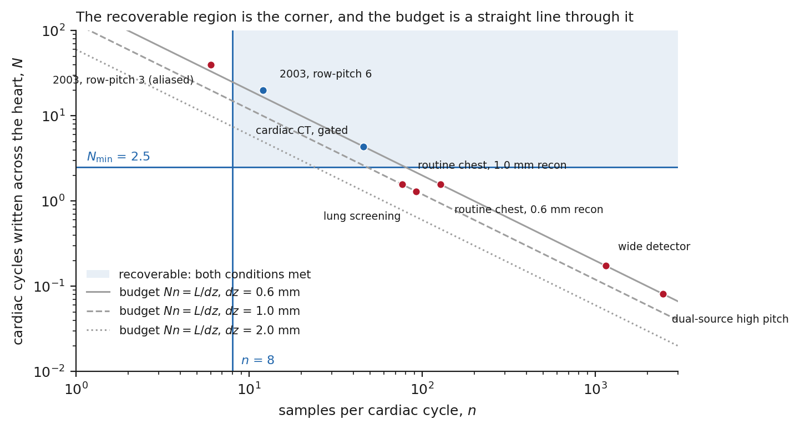
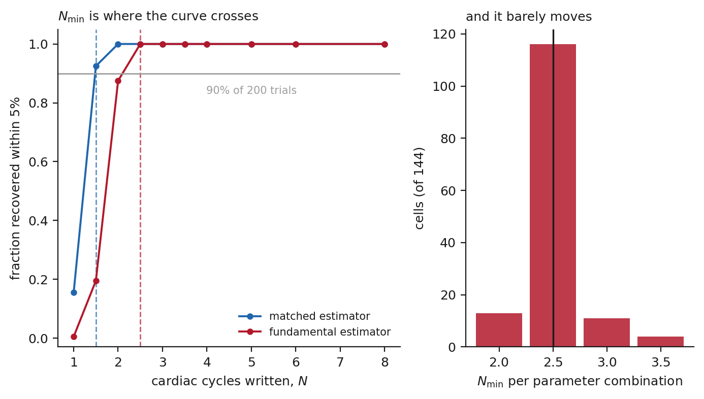
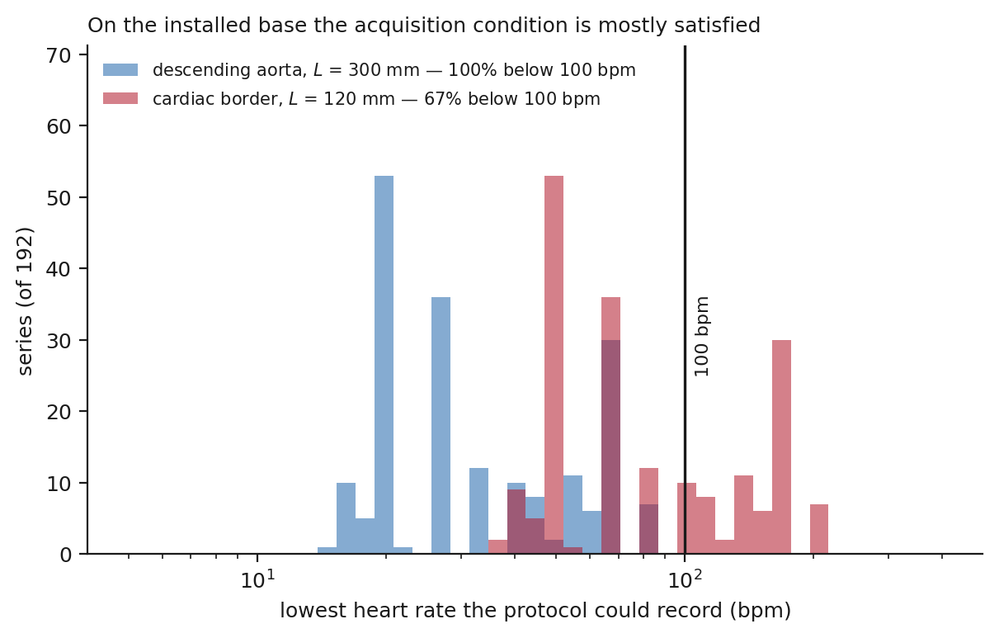
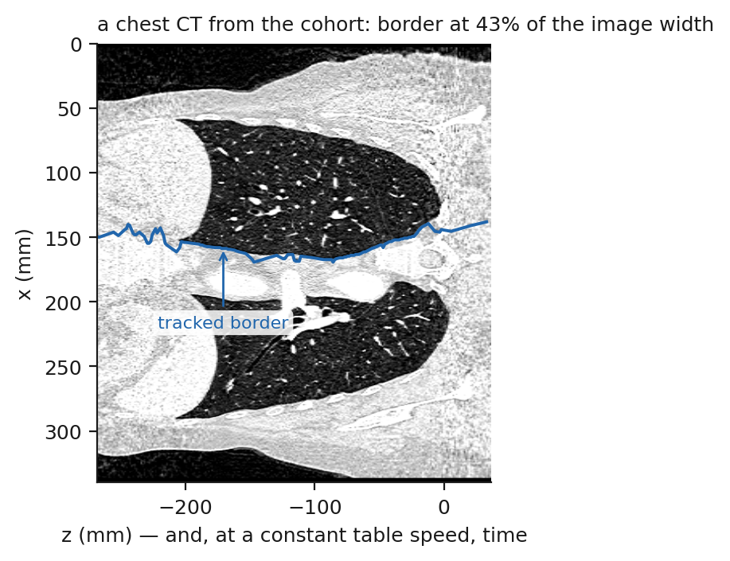
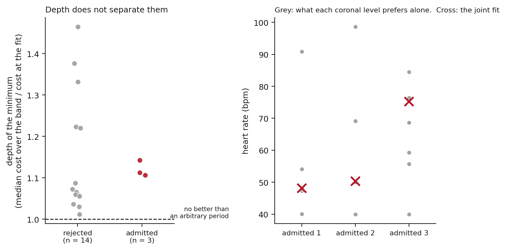
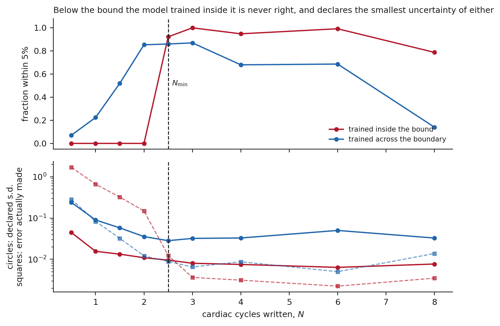

# Cardiac period estimation from non-gated helical CT: sampling criteria and exploratory evaluation

<!-- Every number below is a marker resolved at build time from paper/frozen/manifest.json.
     Nothing is typed by hand. See paper/collect_results.py. -->

Shuji Yamamoto

Institute of One, LISIT Co., Ltd., Tokyo 150-0044, Japan

ORCID 0000-0001-9211-1071. E-mail: yamamoto@lisit.jp

## Abstract

**Objective.** In a non-gated helical chest CT, cardiac motion shapes the undulation of the
mediastinal border. If separable, its period and extrema would be cues to timing, and an
existing scan might be sorted by phase. We ask what sampling conditions make the period
recoverable and how far an image-based estimate can be trusted. Phase and ejection fraction are
not examined.

**Approach.** A constant table speed makes the axial coordinate a nominal time axis, along which
periodic motion writes a spatial period. We state the two requirements, measure the cycles one
needs over [[results:manifest.json:metrics.sensitivity_cells]] simulated conditions, evaluate them on [[results:manifest.json:metrics.header_series]]
real series from headers, and test recovery on [[results:manifest.json:metrics.cohort_analysed]] image series under a frozen
criterion.

**Main results.** Cycles written and samples per cycle multiply to *L*/*dz*, so speed only divides
a fixed budget. The threshold is [[results:manifest.json:metrics.n_min_fundamental]] written cycles for one estimator
and [[results:manifest.json:metrics.n_min_matched]] for a matched one — empirical, not universal. At an assumed cardiac
extent, [[results:manifest.json:metrics.records_below_100bpm_border_percent]] per cent of the real series meet the
requirements for a rate below [[results:manifest.json:metrics.prediction_ceiling_bpm]] bpm — a statement about conditions,
not outcomes, since no rate is recorded. On images the evaluation is also exploratory:
[[results:manifest.json:metrics.cohort_recovered]] of [[results:manifest.json:metrics.cohort_analysed]] series met the self-consistency criterion, yet
their cost minima are no deeper than the rejections' and their levels individually prefer rates
differing by [[results:manifest.json:metrics.flatness_level_spread_accepted_min]] to
[[results:manifest.json:metrics.flatness_level_spread_accepted_max]] bpm.

**Significance.** The requirements are computable from acquisition headers and identify, under
stated assumptions about extent and rate, which conditions meet them. The image
evaluation shows that self-consistency alone does not establish that a period was found: a fit
needs the depth of its minimum and a check on what was fitted. Together they give a basis for
developing and validating such an estimator, whose accuracy and any use for cardiac function will
need a reference measurement.

---

## 1. Introduction

<!-- The framing decision, made deliberately: the subject of the opening sentence is what a
     scan can contain, not what we tried to measure. The cohort appears in section 5 as
     corroboration that the bound is necessary but not sufficient, never as the claim. The
     motivating application is named once, in the second paragraph, and is stated as a
     hypothesis: the step from an undulating border to a usable phase signal is not
     something this paper tests. Nothing in it may be read as evidence about phase
     identification, volumetry or ejection fraction, and the period is presented as one
     route among others rather than as a prerequisite for all of them. -->

A coronal or sagittal reformat of a non-gated helical chest CT shows the left mediastinal
border as an undulating line. It is usually read as a motion artefact. Part of it is written by the heart: the
table advances while the heart moves, so cardiac motion contributes to the shape of that
line whether or not an electrocardiogram was connected.

That is what makes the question in this paper worth asking, and the step from it to a use is
a hypothesis rather than a result. If a component attributable to cardiac motion can be
separated from the rest of the line, then the spacing of its successive maxima would be a cue
to the cardiac period, and its maxima and minima, falling on opposite parts of the cycle, could
serve as cues to phase; a scan already acquired might then be sorted by phase and reformatted
accordingly, and further along that road used for ventricular volumetry. Such a route would
need no electrocardiographic hardware, no additional acquisition and no repeated overlapping
rotations over the heart. **This paper examines one point on that route — whether the period
can be recovered — and examines nothing beyond it.** Estimating phase without first estimating
a period is a different route and is not studied here either. Phase identification,
phase-resolved reconstruction, volumetry and ejection fraction are not studied, and nothing
below should be read as evidence about them.

The opportunity is large because the examinations already exist. Chest CT is acquired in very
large numbers, and lung cancer screening alone has made it a population-scale examination
(National Lung Screening Trial Research Team 2011); the heart is in every one of those scans.
Automated methods increasingly read it: fully automated deep-learning coronary calcium scoring
now runs on non-gated low-dose chest CT (Kim et al 2025), and its output depends on the
acquisition parameters of the scan it is given (Chen et al 2026). In the gated setting, deep
learning is also used to remove cardiac motion from the images themselves (Ren et al 2022).

A method of that kind makes a claim about a heart that was never synchronised to the scanner.
The obvious way to check such a claim is to compare it with the rate the scanner recorded,
and that comparison is not available. Of the
[[results:manifest.json:metrics.cardiac_tag_series_checked]] series whose images we analysed, none records the rate
by any of [[results:manifest.json:metrics.cardiac_routes_checked]] routes through which a CT acquisition can write one.

Rather than assess any particular method, we ask what the acquisition can contain. Recovering
timing from the image itself is not a new idea in CT. Reconstruction correlated with a
recorded electrocardiogram came first (Kachelrieß and Kalender 1998), and was then replaced
by a signal read out of the projection data — the kymogram (Kachelrieß et al 2002) — and
later by gating estimated from the reconstructed images themselves (Rohkohl et al 2008). The
same idea carried small-animal imaging, where respiratory and cardiac gating without a
physiological monitor became routine (Badea et al 2004, Bartling et al 2007). Every one of
those settings has an acquisition that dwells: a cardiac or micro-CT protocol writes many
cycles into the data. That line of work largely stops around 2009.

A separate literature treats the heart in non-gated chest CT, but structurally — thrombus,
calcification, aortic root, incidental infarct, epicardial fat. Gating inferred from the data
rather than from a monitor has continued elsewhere, in MRI (Larson et al 2003) and in PET,
where it now outperforms device-based gating (Walker et al 2020), but not in helical CT of
the chest. We found no indexed report that recovers cardiac timing from a non-gated helical
CT, and none that states the condition under which it could be recovered.

This paper sets out the two sampling requirements recovery has to satisfy, shows that their
product is fixed by anatomy and reconstruction interval alone, and measures the constant one
of them needs for one estimator on simulated traces. It then evaluates the requirements
against the installed base from acquisition headers, and tests recovery on images under a
criterion frozen in advance. That image test is exploratory: no public acquisition we could
find pairs a reconstructed helical chest series with a recorded rate, so a self-consistent
estimate cannot be confirmed as a correct one, and we report which further measurements
separate the two. A closing simulation asks what uncertainty a learned estimator declares
outside its training range. The contribution is a way of connecting acquisition parameters
to the interpretation of an estimate: a framework for choosing the acquisitions on which a future
period or phase estimator could be tested, and for reading what its output means. It is not a
limit on the cardiac information a CT can hold, and it is not a demonstration of clinical
usefulness.

## 2. Theory

### 2.1 The z axis of a helical scan is a time axis

In a helical acquisition the table advances at a constant speed *S* while the gantry rotates,
so the axial coordinate of the reconstructed volume and the time of acquisition are related
by *z* = *St*. The scale is known from the header, and the *nominal* acquisition time it
gives is the same for every voxel at a given *z* whatever its row or column: to that
approximation, a slice is a slice of time as much as of anatomy. How far the reconstructed
value at a voxel departs from that nominal instant is the subject of the assumptions below.

A structure that moves periodically with period *T* therefore writes that period into the
volume as a *spatial* period along *z*,

> *λ* = *S T*.

For the heart this is the wavy left mediastinal silhouette familiar from a coronal reformat.
Below the heart the same silhouette continues as the descending aorta against the left lung,
extending the length over which the wave is available.

**Two assumptions are carried by *λ* = *ST* and neither is tested in this study.** The first
is that the table speed is constant across the analysed span and that the header reports it
correctly. The second concerns reconstruction. Each reconstructed slice is formed from
projections spanning a finite gantry interval and, on a multi-row detector, from interpolation
along *z*, so the border position recorded at a given *z* is an average over a temporal
footprint rather than an instantaneous position. Such averaging attenuates the periodic
component and can displace its apparent phase, by an amount that depends on the
reconstruction algorithm, the collimation and the interpolation used. The relation *z* = *St*
describes the acquisition; it is not a guarantee that the periodic displacement reaches the
voxels undistorted, and the simulations of section 3 model the trace rather than the
reconstruction that produced it.

### 2.2 The recoverability window

Whether *λ* can be recovered is a sampling question with two sides that pull against each
other.

The scan must be **slow enough** that more than one cycle is written across the structure. If
the available craniocaudal extent is *L*, the number of cycles written is *N* = *L*/*λ* =
*L*/(*ST*), and measuring a period requires *N* to exceed some *N*min. This places an upper
limit on *S*.

The scan must be **fast enough** that each cycle is spread across enough reconstructed
samples to be resolved. With reconstruction interval *dz*, the samples per cycle are *n* =
*λ*/*dz* = *ST*/*dz*, and this must exceed some *n*min. This places a lower limit on *S*.

**The value of *n*min is a judgement and is the one such number in this analysis.** Two
samples per cycle is the formal floor and is not usable, because a two-sample sinusoid is a
straight line to any estimator with noise in it. We take eight throughout, and the sweep of
section 3 covers [[results:manifest.json:metrics.sweep_samples_min]], 16 and
[[results:manifest.json:metrics.sweep_samples_max]] samples per cycle so that the effect of
the choice on *N*min can be read off rather than assumed. Nothing in the budget identity
below depends on it.

Together they define a window in table speed, in closed form, for a given *L*, *dz* and heart
rate. The trade-off itself is old — pitch has always been chosen against longitudinal
sampling (Wang and Vannier 1997, Kalender 2006) — but the quantity being traded here is
cardiac timing rather than spatial resolution. The acquisition side of the window comes entirely from the DICOM
header of any helical scan: table speed (0018,9309), or equivalently spiral pitch factor
(0018,9311) with total collimation (0018,9307) and revolution time (0018,9305). The other
two quantities are not in the header. *L* is an assumption about which structure carries the
motion, and *T* is the patient's period, which none of the series studied here records. The
window is therefore evaluated under stated assumptions about both, which is why section 4
reports it at two values of *L*.

One ambiguity has to be closed explicitly. The spiral pitch factor of the IEC convention is
table travel per rotation divided by the *total* collimated width, whereas the convention in
use on four-row scanners divided by a *single* row width; the two differ by the number of
rows. The implementation converts between them rather than accepting either silently.

### 2.3 The budget identity

Multiplying the two quantities removes the heart rate and the table speed at once:

> *N* × *n* = (*L*/*ST*) × (*ST*/*dz*) = *L* / *dz*.

**The product of cycles observed and samples per cycle is fixed by the anatomy and the
reconstruction interval alone.** It does not depend on pitch, on rotation time, or on how
fast the heart is beating. A protocol cannot acquire more cardiac timing by running faster or
slower; it can only divide a fixed budget between seeing more cycles and resolving each one
better. Making a scan slower buys cycles at the cost of resolution within a cycle, and making
it faster does the reverse.

This is why the question has a definite answer for each protocol, and why the answer is
computable before any image exists (figure 1). It also locates the one quantity the condition
still needs: the window is bounded by *N*min, and *N*min is not given by the geometry.
Section 3 measures it.

**Figure 1.** Cycles written across the heart against samples per cardiac cycle, at 60 bpm,
on logarithmic axes. Each protocol is a point; the grey lines are the budget *N n* = *L*/*dz*
for three reconstruction intervals, and a protocol can move only along its own line. The
shaded corner is the region in which both conditions hold, bounded below by *N*min =
[[results:manifest.json:metrics.n_min_fundamental]] cycles and on the left by *n* = 8 samples
per cycle. Blue points satisfy both conditions, red points fail at least one. The two 2003
four-row protocols are the acquisitions from which this problem originally arose; the modern
chest protocols sit an order of magnitude to the right and below the bound, having spent the
whole budget on resolution within a cycle.

## 3. How many cycles are needed

### 3.1 Simulation design

How precisely a frequency can be estimated from a finite record is a classical question, and
the answer depends on the observation length, the signal-to-noise ratio and the estimator
(Rife and Boorstyn 1974). What that theory does not give is the number of cycles at which a
particular estimator, reading a particular signal, starts to succeed in practice. *N*min is a
property of the estimation problem — of noise, of how well the cardiac border can be located
against lung and mediastinum, and of how far a real rhythm departs from a fixed period — so
it was measured rather than assumed. A periodic border trace was generated with
a prescribed period, a polynomial baseline standing for anatomy, additive noise, and
beat-to-beat variability, and the period was estimated from it. Recovery was scored against
the prescribed period at a tolerance of
[[results:manifest.json:metrics.tolerance_percent]] per cent, and *N*min for a condition was
taken as the smallest number of written cycles at which at least
[[results:manifest.json:metrics.success_rate_percent]] per cent of
[[results:manifest.json:metrics.trials_per_cell]] trials succeeded.

The sweep covered [[results:manifest.json:metrics.sensitivity_cells]] combinations, the full
grid of [[results:manifest.json:metrics.sweep_noise_levels]] noise levels from
[[results:manifest.json:metrics.sweep_noise_min]] to
[[results:manifest.json:metrics.sweep_noise_max]] of the wave amplitude,
[[results:manifest.json:metrics.sweep_baseline_levels]] baseline strengths from zero to
[[results:manifest.json:metrics.sweep_baseline_max]] times it,
[[results:manifest.json:metrics.sweep_samples_levels]] sampling densities of
[[results:manifest.json:metrics.sweep_samples_min]], 16 and
[[results:manifest.json:metrics.sweep_samples_max]] samples per cycle, and
[[results:manifest.json:metrics.sweep_variability_levels]] degrees of beat-to-beat
variability up to [[results:manifest.json:metrics.sweep_variability_max]] of the period. The
central condition against which the headline is quoted is noise 0.1, baseline 1.0, 16 samples
per cycle and variability 0.05. Reporting the whole grid rather than the central cell is what
makes the value a plateau rather than a point.

### 3.2 How far *N*min moves with the estimator, and with the conditions

Two estimators were run over the same traces: one matched to the generating model, and one
using only the fundamental of the trace. The matched estimator reaches
[[results:manifest.json:metrics.n_min_matched]] cycles and the fundamental estimator
[[results:manifest.json:metrics.n_min_fundamental]] cycles. **The remainder of this paper
uses [[results:manifest.json:metrics.n_min_fundamental]]**, because the matched value assumes
knowledge of the waveform that no real trace supplies, and a bound should be stated at the
value a usable estimator can attain.

The figure is stable across the sweep (figure 2):
[[results:manifest.json:metrics.cells_at_headline]] of the
[[results:manifest.json:metrics.sensitivity_cells]] cells return exactly
[[results:manifest.json:metrics.n_min_fundamental]], and the worst cell anywhere in the sweep
returns [[results:manifest.json:metrics.n_min_worst_case]].

**Figure 2.** Left: the fraction of
[[results:manifest.json:metrics.trials_per_cell]] trials in which the prescribed period was
recovered to within [[results:manifest.json:metrics.tolerance_percent]] per cent, against the
number of cycles written, for the matched and the fundamental estimator at the central
parameter condition. *N*min is where each curve crosses
[[results:manifest.json:metrics.success_rate_percent]] per cent, marked by the dashed
verticals at [[results:manifest.json:metrics.n_min_matched]] and
[[results:manifest.json:metrics.n_min_fundamental]] cycles. Right: *N*min obtained
independently in each of the [[results:manifest.json:metrics.sensitivity_cells]] cells of the
sensitivity sweep. The constant is a plateau, not a point estimate. The regime that degrades it is
coarse sampling within a cycle combined with high noise, which is the corner in which the
budget identity of section 2.3 says the two requirements are already competing for the same
fixed product.

## 4. Where real protocols fall

### 4.1 Half of the public archive cannot be asked

Evaluating the condition needs only header fields, but they have to be published. Of
[[results:manifest.json:metrics.collections_probed]] public collections probed in The Cancer
Imaging Archive (Clark et al 2013) for acquisition parameters,
[[results:manifest.json:metrics.collections_with_parameters]] publish them and
[[results:manifest.json:metrics.collections_without_parameters]] do not. For the
latter the question cannot be put at all — not because the scans fail the condition, but
because nothing in the archive says what the table was doing.

This is worth stating plainly because it bounds any future study of the same kind, including
the validation of motion-correction methods that this paper is about. A collection that omits
table speed, pitch, collimation and rotation time cannot support a claim about what its scans
could or could not have recorded.

### 4.2 Table speeds and thresholds

The [[results:manifest.json:metrics.header_series]] series come from
[[results:manifest.json:metrics.header_patients]] patients in
[[results:manifest.json:metrics.header_collections]] of the
[[results:manifest.json:metrics.collections_with_parameters]] collections that publish the
parameters, with at most [[results:manifest.json:metrics.header_series_cap]] series taken
from any one of them so that a single large collection cannot set the distribution.
[[results:manifest.json:metrics.header_collections_at_cap]] reach that cap and the fifth
contributes [[results:manifest.json:metrics.header_smallest_collection]]. Table speed runs
from
[[results:manifest.json:metrics.table_speed_min]] to
[[results:manifest.json:metrics.table_speed_max]] mm/s, a factor of
[[results:manifest.json:metrics.table_speed_ratio]], with a median of
[[results:manifest.json:metrics.table_speed_median]] mm/s.

Because faster hearts write more cycles into the same distance, each protocol has a *lowest*
rate it can record. Over the cardiac border alone that threshold has a median of
[[results:manifest.json:metrics.threshold_median_border]] bpm, ranging from
[[results:manifest.json:metrics.threshold_min_border]] to
[[results:manifest.json:metrics.threshold_max_border]] bpm, and
[[results:manifest.json:metrics.records_below_100bpm_border]] of
[[results:manifest.json:metrics.header_series]] series —
[[results:manifest.json:metrics.records_below_100bpm_border_percent]] per cent — have a
threshold below [[results:manifest.json:metrics.prediction_ceiling_bpm]] bpm. Using the
longer extent available along the descending aorta, the median threshold falls to
[[results:manifest.json:metrics.threshold_median_aorta]] bpm and
[[results:manifest.json:metrics.records_below_100bpm_aorta_percent]] per cent of series
qualify.

**Under the assumptions used here, most of the installed base clears the threshold** (figure 3).
Because the patients’ own rates are not recorded, that is a statement about what those
protocols could record, not a count of acquisitions that did satisfy the condition. It is
enough to make section 5 worth performing.

**Figure 3.** The lowest heart rate each of the
[[results:manifest.json:metrics.header_series]] real chest CT series could record, computed
from its header alone at *N*min = [[results:manifest.json:metrics.n_min_fundamental]] cycles,
over the cardiac border (*L* = 120 mm) and over the descending aorta (*L* = 300 mm). The
vertical line is [[results:manifest.json:metrics.prediction_ceiling_bpm]] bpm: series to its
left could record any physiological rate above their own threshold.

The exceptions are instructive. A wide-detector protocol at
[[results:manifest.json:metrics.threshold_wide_detector_speed]] mm/s has a threshold of
[[results:manifest.json:metrics.threshold_wide_detector]] bpm, and a dual-source high-pitch
protocol at [[results:manifest.json:metrics.threshold_dual_source_high_pitch_speed]] mm/s a
threshold of [[results:manifest.json:metrics.threshold_dual_source_high_pitch]] bpm. Both are
far above any physiological rate: at the assumed structure extent, and at any physiological
rate, these acquisitions cross the heart so quickly that less than one full cycle is
written, so no complete repetition is present in the record. They fail the cycle-count
criterion of this paper by the widest margin in the survey.

## 5. Meeting the threshold does not produce a period

### 5.1 A cohort under a frozen criterion

<!-- What the frozen criterion measures, stated here so the prose cannot drift from it.
     A series is admitted when the leave-one-out spread of the fitted rate is at most
     10 bpm and the median sigma is at most 1.0. Both are measures of SELF-CONSISTENCY:
     they say the fit did not move when a level was removed. Neither compares the fitted
     rate with the patient's heart rate, because no such rate is recorded
     (section 5.3). The word "recovered" therefore may not appear unqualified anywhere in
     this paper: write "self-consistent", or "recovered" only inside the simulation of
     section 3, where a true period exists. The result files keep the field name
     `recovered` for continuity with the frozen run; the prose does not inherit it. -->

The cohort comprised [[results:manifest.json:metrics.cohort_series]] series, of which
[[results:manifest.json:metrics.cohort_analysed]] yielded a volume the extraction could read;
the remaining [[results:manifest.json:metrics.cohort_technical_failures]] is reported as a
technical failure and enters no count. They are drawn from the same
[[results:manifest.json:metrics.header_series]] series evaluated in section 4 — all
[[results:manifest.json:metrics.cohort_from_header_set]] of them — one series per patient, so
[[results:manifest.json:metrics.cohort_patients]] patients contribute one each and no patient
appears twice. [[results:manifest.json:metrics.pilot_series]] of them were the pilots on
which the extraction was developed, and they are retained rather than dropped because
removing them after the fact would be a choice made with the outcomes visible.

A series was admitted when the joint fit spanned at
least *N*min = [[results:manifest.json:metrics.n_min_fundamental]] cycles, was not pinned at
either edge of the physiological band, drew on at least three usable coronal levels, moved by
no more than 10 bpm when any one level was dropped, and left a median residual below the
amplitude it had fitted. Those thresholds were written down before any series beyond the
three pilots was fitted.

One detail of that first condition matters and is easy to miss. The implementation counts
cycles over the **z span actually analysed**, not over *L*, the extent of the structure that
section 2 says can carry the motion. For this cohort the two are close: the analysed spans
run from [[results:manifest.json:metrics.cohort_span_min_mm]] to
[[results:manifest.json:metrics.cohort_span_max_mm]] mm with a median of
[[results:manifest.json:metrics.cohort_span_median_mm]] mm against an aortic extent of
[[results:manifest.json:metrics.extent_aorta_mm]] mm, and the same
[[results:manifest.json:metrics.cohort_over_nmin_by_span]] series clear *N*min either way. It
is stated here because for the one series in section 5.4 the two differ by a factor of two.

What the fit reads is a one-dimensional trace of that border against z (figure 4). At each
slice of a coronal row, the candidates are the runs above
[[results:manifest.json:metrics.lung_threshold_hu]] HU that cross the row's midline and are
at least [[results:manifest.json:metrics.min_mediastinum_mm]] mm wide, and the border is the
left edge of the chosen run. The border is followed rather than chosen independently on each
slice: tracking begins in the middle of the scan where the mediastinum is widest, each slice
takes the candidate nearest to the previous one, and a slice with no candidate within 6 mm is
left empty rather than filled with the nearest available structure.
[[results:manifest.json:metrics.coronal_levels]] rows are attempted, at fractions
[[results:manifest.json:metrics.coronal_fraction_low]] to [[results:manifest.json:metrics.coronal_fraction_high]] of the image height, and every one that yields a
trace is reported rather than the clearest. A row is kept when the tracker returns a border on
at least [[results:manifest.json:metrics.min_slices_per_level]] slices; rows that fail that test are rows where no run above the lung
threshold crosses the midline widely enough often enough, the mediastinum not being equally wide
at every height in every patient. Across the cohort [[results:manifest.json:metrics.levels_usable_min]] to [[results:manifest.json:metrics.levels_usable_max]] rows survive,
and the criterion below requires at least three.

The period is fitted to all levels at once. Writing *u* = (*z* − *z*₀)/λ, with λ = *ST* the spatial period of section 2.1, and *v* = (*z* −
*z*₀)/span, each level is modelled as a sinusoid on a quartic baseline, *a* cos 2π*u* + *b*
sin 2π*u* + *c*₀ + *c*₁*v* + *c*₂*v*² + *c*₃*v*³ + *c*₄*v*⁴, whose coefficients are solved by
least squares at each trial period; amplitude and phase are therefore free per level while
the spatial period λ is common, because there is one heart and because in a helical scan the nominal
acquisition time is a function of *z* alone, so every level shares it to the same
approximation (section 2.1). The joint cost at a
period is the sum over levels of the residual sum of squares, each weighted by the reciprocal
of that level's variance, so a level with a large anatomical swing does not outvote the
others. The spatial period is taken as the minimiser over 600 points spanning
[[results:manifest.json:metrics.band_slowest_bpm]] to
[[results:manifest.json:metrics.band_fastest_bpm]] bpm at the header's table speed; that band
is physiological, and is never set by what the data prefer.

**Figure 4.** A coronal reformat from one of the admitted series, at its own aspect — one
millimetre along z is one millimetre along x — with the tracked border drawn on it. The
border follows the mediastinum between the two lungs, which is the structure the method is
defined on. Its position, [[results:manifest.json:metrics.border_admitted_max_percent]] per
cent of the image width here, is what section 5.4 measures for every series.

**What that criterion measures is self-consistency.** Leave-one-out movement and residual
size both ask whether the fit holds still; neither compares the fitted rate with the
patient's. No series here records one (section 5.4), so correctness was not available to be
tested, and the criterion should not be read as if it had been. The count that follows is
therefore a count of series meeting a self-consistency criterion. It is neither a count of
correct estimates nor a count of incorrect ones, and it is not an accuracy.

[[results:manifest.json:metrics.cohort_recovered]] of the
[[results:manifest.json:metrics.cohort_analysed]] series met it. The header-level condition
predicted [[results:manifest.json:metrics.cohort_predicted_recoverable]] of them to be
recoverable at a ceiling of [[results:manifest.json:metrics.prediction_ceiling_bpm]] bpm, and
[[results:manifest.json:metrics.cohort_predicted_and_recovered]] of those
[[results:manifest.json:metrics.cohort_predicted_recoverable]] were admitted.

**The pre-specified summary was the agreement between prediction and outcome, not the
admission rate.** The two agreed on [[results:manifest.json:metrics.cohort_agreement]] of
[[results:manifest.json:metrics.cohort_analysed]] series,
[[results:manifest.json:metrics.cohort_agreement_percent]] per cent.

That number needs reading carefully, and we state it descriptively rather than as a test. The
prediction is a header-level statement about whether a rate below
[[results:manifest.json:metrics.prediction_ceiling_bpm]] bpm could in principle be written;
the outcome is a self-consistency verdict that never sees a true rate. They are not two
measurements of the same thing, so their disagreement is not evidence that either is wrong,
and we attach no null distribution to it. With [[results:manifest.json:metrics.cohort_analysed]] series and two
quantities that are not measurements of the same thing, the figure is not strong enough to
establish a relation between criterion and acquisition parameters, nor the absence of one; we
report it because it was the pre-specified summary. What the admissions are responding to is
examined directly in sections 5.3 and 5.4, which is the more informative route.

### 5.2 How real traces differ from the simulated ones

The border traces of the real series do not merely fit worse than simulated ones, they differ
in kind. Comparing [[results:manifest.json:metrics.diagnosis_traces_real]] real traces with
[[results:manifest.json:metrics.diagnosis_traces_simulated]] simulated ones,
[[results:manifest.json:metrics.baseline_share_real_percent]] per cent of the real signal
sits in the smooth baseline the fit removes, against
[[results:manifest.json:metrics.baseline_share_simulated_percent]] per cent of the simulated
signal, and the spread of band power across levels is
[[results:manifest.json:metrics.band_fraction_spread_ratio]] times wider in the real traces
([[results:manifest.json:metrics.band_fraction_spread_real]] against
[[results:manifest.json:metrics.band_fraction_spread_simulated]]). A real trace is mostly
anatomy, and how much of it is anatomy varies from level to level in a way the simulation
never produced.

[[results:manifest.json:metrics.diagnosis_properties]] properties were measured on both
populations: the share of the signal removed by the quartic baseline, the fraction of the
remaining power inside the physiological band, that band's enrichment over the rest of the
spectrum, the rate of large slice-to-slice steps, and the drift of the wave's amplitude
across the scan. Two of the five separate the populations sharply. The baseline share is the
one quoted above. The other is the amplitude drift: a real trace's wave grows or shrinks by a
median factor of [[results:manifest.json:metrics.amplitude_drift_real]] from one end of the
scan to the other, against
[[results:manifest.json:metrics.amplitude_drift_simulated]] in simulation, so the amplitude
the fit assumes to be constant is not. Large steps are absent from the median trace in both
populations but reach
[[results:manifest.json:metrics.large_steps_real_p90]] per hundred slices at the ninetieth
percentile of the real ones, against
[[results:manifest.json:metrics.large_steps_simulated_p90]] in simulation.

**These are differences, not causes.** We did not put any of them back into the simulator to
see whether the failure reappears, and this section should not be read as having excluded
them. It establishes that the signal the estimator was designed for is not the signal it is
given, and section 5.3 reports a property of the objective that is measured rather than
inferred.

### 5.3 The objective is nearly flat, and the criterion never looked

The criterion asks whether the argmin moves. It does not ask whether the cost surface has a
minimum worth finding. Those are different questions whenever the surface is flat, and the
following measurement was not part of the frozen analysis; it was added after the fact, for
the reason given in section 5.4.

Measure the depth of the minimum as the median cost across the whole physiological band
divided by the cost at the period the fit returned. A value of 1.00 would mean the chosen
period fits no better than an arbitrary one.

Across the cohort the depth is
[[results:manifest.json:metrics.flatness_depth_rejected_median]] at the median of the
rejected series, ranging from [[results:manifest.json:metrics.flatness_depth_rejected_min]]
to [[results:manifest.json:metrics.flatness_depth_rejected_max]]. **The
[[results:manifest.json:metrics.cohort_recovered]] admitted series lie inside that range**,
at [[results:manifest.json:metrics.flatness_depth_accepted_min]] to
[[results:manifest.json:metrics.flatness_depth_accepted_max]]: the period chosen in an
accepted series reduces the weighted residual by about a tenth relative to a typical period
in the band, which is what the rejected series do as well. On this measure the admissions are
not distinguishable from the rejections.

They are also not consensus (figure 5). In each of the
[[results:manifest.json:metrics.cohort_recovered]] admitted series the usable coronal levels — [[results:manifest.json:metrics.levels_admitted_each]]
of them — fitted independently, prefer rates whose spread, the largest minus the smallest
within that series, is [[results:manifest.json:metrics.flatness_level_spread_accepted_min]] to
[[results:manifest.json:metrics.flatness_level_spread_accepted_max]] bpm. The joint fit
imposes one period on levels that individually disagree by half the physiological range, and
returns their weighted compromise.

**What follows from this is about the criterion, and we are careful about how far it goes.**
Two things are measured: the minima the criterion accepted are no deeper than those it
rejected, and the levels it combined did not agree. Neither measurement uses a true rate, so
neither can show that the three admitted rates are *wrong*. What they do show is that the
criterion admitted them without evidence that they are right, which is a different and
weaker claim than the one a reader would take from the word "recovered".

A natural explanation of how that happens is that a flat objective leaves the minimiser
unpinned, so removing one level moves it very little, and the leave-one-out test then reports
stability that reflects the shape of the objective rather than the strength of a signal. That
account is consistent with everything reported here — shallow minima, disagreeing levels, and
stable leave-one-out values occurring together — but co-occurrence is not demonstration, and
we have not constructed the experiment that would separate the flatness from the stability.
We therefore offer it as an explanation to be tested, and rest the conclusion on the
measurements rather than on the mechanism.

One reading it does weaken is that the extraction simply locks onto the wrong peak. With the
best period fitting only about a tenth better than a typical one, there is no peak in these
objectives sharp enough for that description to be apt.

**Figure 5.** Left: depth of the minimum, defined as the median cost across the physiological
band divided by the cost at the period returned, for the series the frozen criterion rejected
and for those it admitted. A value
of 1.0, the dashed line, would mean the chosen period fits no better than an arbitrary one.
The admitted series lie inside the range of the rejected ones. Right: for each admitted
series, the rate each usable coronal level prefers when
fitted alone (grey), against the rate the joint fit returns (cross). The joint fit reports a
compromise among levels that do not agree.

### 5.4 A candidate session with a recorded rate, which could not be used

A criterion that cannot be compared with a true rate can be characterised but not scored for
accuracy, so we searched for a session that records one. Of
[[results:manifest.json:metrics.tcia_collections_surveyed]] collections in The Cancer Imaging
Archive, [[results:manifest.json:metrics.tcia_collections_with_ct]] hold CT and
[[results:manifest.json:metrics.tcia_cardiac_studies]] studies are described as a cardiac
examination; [[results:manifest.json:metrics.tcia_sessions_with_recorded_rate]] sessions
record a rate in the header, and
[[results:manifest.json:metrics.tcia_sessions_with_rate_and_helical]] contains both a
recorded rate and a free-running helical series of the chest.

The rate is not where a reader would look for it. `HeartRate (0018,1088)` is empty
throughout; the scanner writes the rate into the free text of `ScanOptions (0018,0022)` as a
minimum, maximum and average in bpm. A survey restricted to the standard cardiac fields
concludes that no public CT records the rate, and is wrong; the count in section 4 was
repeated over [[results:manifest.json:metrics.cardiac_routes_checked]] routes for that
reason. In that session a gated acquisition records
[[results:manifest.json:metrics.reference_rate_recorded]] bpm, between
[[results:manifest.json:metrics.reference_rate_range_low]] and
[[results:manifest.json:metrics.reference_rate_range_high]] over its own duration, and a
helical series covering [[results:manifest.json:metrics.reference_z_span_mm]] mm at
[[results:manifest.json:metrics.reference_table_speed]] mm/s begins ten seconds later.

**The series could not be used.** The extraction did not return the anatomical border the
method is defined on. Its tracked position lies at
[[results:manifest.json:metrics.border_reference_percent]] per cent of the image width, where
a mediastinum in this cohort lies between
[[results:manifest.json:metrics.border_sound_min_percent]] and
[[results:manifest.json:metrics.border_sound_max_percent]] per cent, and at one coronal level
the value is constant to numerical precision across the whole scan. What structure it locked
onto instead is not established. Nothing in the pipeline indicated the failure: the fit
converged, the residual test passed and the leave-one-out values clustered, and only two
levels departing to the edge of the physiological band kept the series out. The run is
reported in the supplementary material with the protocol that was fixed before it, and it
does not enter any estimate of recovery accuracy.

Having found it in one series, we measured it in all of them. Of the
[[results:manifest.json:metrics.cohort_analysed]] analysed cohort series,
[[results:manifest.json:metrics.border_cohort_on_the_surface]] sit within
[[results:manifest.json:metrics.border_surface_threshold_percent]] per cent of the image edge
and [[results:manifest.json:metrics.border_cohort_doubtful]] more sit closer to the edge than
to the middle. **All of the affected series were rejected by the frozen criterion**, and the
[[results:manifest.json:metrics.cohort_recovered]] admitted series lie at [[results:manifest.json:metrics.border_admitted_min_percent]] to
[[results:manifest.json:metrics.border_admitted_max_percent]] per cent. The measurement is made per coronal level and
not per series, because a series median near the middle could hide a single level out at the
edge, which is what happened on the reference case. All [[results:manifest.json:metrics.border_admitted_levels]] usable levels of the three
admitted series lie between [[results:manifest.json:metrics.border_admitted_level_min_percent]] and [[results:manifest.json:metrics.border_admitted_level_max_percent]] per cent of the image width, and figure 4
draws the border on the image for the one of the three whose border sits deepest. **What that
establishes is the absence of the specific failure it was written to detect**, a border out at the
surface. It is not a test of anatomical correctness: a position near the middle of the image is
where the mediastinum is, and also where several other structures are. Section 5.5 examines
all three admitted series as images and reports what this check misses. The check that measures this,
`analysis/check_border_position.py`, did not exist while the cohort was being analysed.

### 5.5 What the admitted series were actually measuring

To find out what the three admitted series were measuring, every usable coronal level of each
— [[results:manifest.json:metrics.audit_levels]] in all — was drawn as a reformat with its tracked border on it and examined. The
images are in the supplementary material, and `analysis/audit_admitted_levels.py` produces them
and the numbers below. Neither alters the frozen outcome of section 5.1.

**No admitted level is on the skin.** None of the [[results:manifest.json:metrics.audit_levels]] lies within
[[results:manifest.json:metrics.border_surface_threshold_percent]] per cent of the image edge, so the failure of section 5.4 does not recur
here. Looking at the reformats shows a
different failure that the position check cannot see. Beyond the lung base, and past the apex,
the tracker still returns a border although there is no lung there: both sides of it are soft
tissue at about 0 HU, and no lung–mediastinum interface exists. Classifying every returned point
by the attenuation on each side — aerated lung one side, soft tissue the other —
[[results:manifest.json:metrics.audit_points_at_a_lung_interface]] of [[results:manifest.json:metrics.audit_points]] points, or
[[results:manifest.json:metrics.audit_share_at_a_lung_interface_percent]] per cent, sit at such an interface. **No level is
wholly clean**, and on the worst [[results:manifest.json:metrics.audit_worst_level_percent]] per cent are.

The consequence is not evenly spread, and for one series it is serious. The points that do sit at
a lung interface span a shorter stretch of *z* than the levels as a whole, and the criterion of
section 5.1 counted cycles over the whole. Re-counted over the valid stretch at the period each
fit returned, [[results:manifest.json:metrics.audit_series_below_nmin_on_valid_span]] of the
[[results:manifest.json:metrics.cohort_recovered]] admitted series falls below *N*min: its valid stretch is
[[results:manifest.json:metrics.audit_worst_valid_share_percent]] per cent of the span analysed, and the cycles written
across it are [[results:manifest.json:metrics.audit_worst_cycles_valid]] rather than the
[[results:manifest.json:metrics.audit_worst_cycles_analysed]] the criterion recorded. That series met the cycle-count
condition on paper and does not meet it over the part of the scan where the extraction is on the
structure the method is defined on.

Two further properties are visible in the reformats and were not measured before: the traces
are sparse, with [[results:manifest.json:metrics.audit_max_gap_percent]] per cent of slices returning no border at all on the worst level, and
the tracked line is smooth where the method expects an undulation — the same thing section 5.3
reads off the objective. For all three admissions, then, the fitted period rests on a partial
trace of a partly correct border.

## 6. An auxiliary experiment: the uncertainty an estimator declares outside its training range

Sections 2 to 5 concern what an acquisition contains. This section asks a smaller and separate
question, in simulation throughout: when an estimator is asked for an answer outside the range
it was trained on, what does it report about its own reliability? It is included because an
estimate is acted on together with whatever uncertainty accompanies it, so that uncertainty is
itself something that has to be checked.

### 6.1 The experiment

An estimator was trained on the same simulated traces to predict the period and, alongside it,
its own standard deviation (Kendall and Gal 2017). Modern networks are systematically
overconfident (Guo et al 2017), and more so away from the training distribution
(Ovadia et al 2019); what is measured here is one such shift, produced by moving the test
points outside the range of the target rather than by changing the dataset. Each trace has the same quartic
baseline removed as elsewhere in this paper, is divided by its own standard deviation and is
resampled to a fixed length, and the target is the period **as a fraction of the trace
length** — the reciprocal of the cycles written — so the standard deviations quoted below are
in those units. The model is a small multilayer perceptron with separate heads for the mean and
the log variance, trained on [[results:manifest.json:metrics.learned_train_size]] traces by minimising the Gaussian
negative log-likelihood; the architecture, the optimiser and the training schedule are set out
in the supplementary material and in `analysis/learned_estimator.py`. Accuracy is scored on
[[results:manifest.json:metrics.learned_test_per_point]] independent traces at each of nine cycle counts within the same
[[results:manifest.json:metrics.tolerance_percent]] per cent tolerance as section 3, and calibration is the ratio of the
error actually made to the standard deviation reported, so that 1 is honest and larger is
overconfident.

Two models were trained, differing only in the range of traces they saw: one on
[[results:manifest.json:metrics.learned_above_low]] to [[results:manifest.json:metrics.learned_above_high]] cycles, at or above the bound, and one
on [[results:manifest.json:metrics.learned_across_low]] to [[results:manifest.json:metrics.learned_across_high]] cycles.

Because the target is a reciprocal, testing below the bound is testing outside the first
model's training range. It saw targets between [[results:manifest.json:metrics.learned_above_target_low]] and
[[results:manifest.json:metrics.learned_above_target_high]]; at two cycles the correct answer is
[[results:manifest.json:metrics.learned_target_at_two_cycles]] and at half a cycle [[results:manifest.json:metrics.learned_target_at_half_cycle]],
five times the largest value it was ever shown. Its failures there are failures of
extrapolation and establish nothing about the information in the trace. Both models are trained
and tested on simulated traces only, and nothing in this section is evidence about real chest
CT.

### 6.2 What the two models report

At and above the bound the model trained there works, reaching
[[results:manifest.json:metrics.above_accuracy_at_bound_percent]] per cent accuracy. Below the bound it is wrong in every
trial — [[results:manifest.json:metrics.above_accuracy_below_max_percent]] per cent accuracy at every cycle count tested —
while reporting a standard deviation no larger than [[results:manifest.json:metrics.above_reported_sd_below_max]], so its
calibration ratio there runs from [[results:manifest.json:metrics.above_calibration_below_min]] to
[[results:manifest.json:metrics.above_calibration_below_max]]: the error it makes is between twelve and forty times the
uncertainty it declares. **The declared uncertainty tightens as the accuracy stays at zero**
(figure 6). As the number of written cycles rises towards the bound the reported standard
deviation falls and the accuracy does not move, so at two cycles the model is at its most
certain and still never right, and nothing in what it returns marks those points as different
from the ones it can serve.

**Figure 6.** Top: the fraction of estimates within [[results:manifest.json:metrics.tolerance_percent]] per cent of the
prescribed period, against cycles written, for a model trained only at or above the bound and
for one trained across it. Bottom, on a logarithmic scale: the standard deviation each model
declares (circles) and the error it actually makes (squares). Below *N*min, marked by the
dashed vertical, the model trained inside the bound declares the smallest uncertainty of either
while its error is largest — the gap between its circles and its squares is the overconfidence.
Those test points lie outside the range of the target that model was trained on. The model
trained across the boundary keeps the two together.

The model trained across the boundary behaves differently below the bound: its reported
standard deviation widens to [[results:manifest.json:metrics.across_reported_sd_below_max]] as the cycles run out and its
calibration ratio falls into [[results:manifest.json:metrics.across_calibration_below_min]] to
[[results:manifest.json:metrics.across_calibration_below_max]], which is honest to conservative. Neither model abstains —
both always return an estimate, and what differs is the uncertainty attached to it — so whether
a scan is declined or flagged remains a decision for whoever deploys such an estimator, and one
available to them only if the uncertainty means something.

Two qualifications limit what this comparison supports. The across-trained model also becomes
*accurate* below [[results:manifest.json:metrics.n_min_fundamental]] cycles, reaching
[[results:manifest.json:metrics.across_accuracy_below_max_percent]] per cent at two. That is not a violation of the bound
but the bound at a different value: *N*min depends on what the estimator knows about the
waveform, and a network trained on this exact family of traces has been handed knowledge it
would not have in a patient, which is why [[results:manifest.json:metrics.n_min_fundamental]] remains the value at which
we state the bound. Second, above the bound that model is the less accurate of the two,
[[results:manifest.json:metrics.across_accuracy_at_bound_percent]] against [[results:manifest.json:metrics.above_accuracy_at_bound_percent]] per
cent. That pair of numbers describes one architecture under one training protocol on one family
of traces. It is a reason to measure the trade-off in a given estimator, not a general result
that calibration costs accuracy.

## 7. Discussion

This study establishes four things, and they rest on evidence of different kinds. The two sampling
requirements follow from the geometry of a helical acquisition, and their product is fixed by the
structure extent and the reconstruction interval, so table speed redistributes a budget it cannot
enlarge. The number of cycles one estimator needs was measured rather than assumed. Applied to
[[results:manifest.json:metrics.header_series]] real series through their headers, and under stated assumptions about extent and
rate, the requirements are satisfiable for most of them. And on images, where no rate is
recorded, a criterion that asks only whether a fit holds still admits series whose objective is
nearly flat, so such a criterion does not establish that a period was found — the most
transferable of the four, and the one this section returns to last.

Two of those results share a structure that is worth stating once.

In section 5 a stability criterion admitted [[results:manifest.json:metrics.cohort_recovered]]
series whose coronal levels, taken separately, preferred rates spread over
[[results:manifest.json:metrics.flatness_level_spread_accepted_min]] to
[[results:manifest.json:metrics.flatness_level_spread_accepted_max]] bpm, on cost surfaces
whose minima are no deeper than those of the series it rejected. In section 6 an estimator
trained only inside the recoverable regime reported a standard deviation of
[[results:manifest.json:metrics.above_reported_sd_below_max]] while achieving
[[results:manifest.json:metrics.above_accuracy_below_max_percent]] per cent accuracy outside
it. In both, a diagnostic internal to the method reported confidence in a regime the method
could not serve, and in neither did the method's own output indicate a problem.

The difference between them is instructive. The estimator's failure is a training failure and
has a training remedy: shown the boundary during training, the same architecture widens its
reported uncertainty to [[results:manifest.json:metrics.across_reported_sd_below_max]] and
reports it where an answer is not available, while reaching
[[results:manifest.json:metrics.across_accuracy_below_max_percent]] per cent accuracy at two
cycles — the calibration is what changes, not a rule about when to answer. The criterion's failure is a design failure, and what section 5.3
measures against it is diagnostic rather than decisive: **a stability statistic on its own
does not say whether the objective it was computed on has a minimum worth being stable
about.** Reporting the depth of the minimum, relative to the median over the searched band,
alongside the disagreement between levels would have made the ambiguity in the three
admissions visible where the stability statistic concealed it. It would not have decided
them. No acceptance threshold on depth is proposed here and none is validated: doing so
would need cases whose rates are known, which is what this study lacks. The depth is
something to report alongside a fit, not a test the fit can pass.

None of this weakens the geometry. What follows separates the three positive claims by the
strength of the evidence behind each, because they should not be read as one.

The budget identity *N n* = *L*/*dz* follows from the definitions and holds for any helical
acquisition. It is the firmest thing here.

*N*min = [[results:manifest.json:metrics.n_min_fundamental]] cycles is an empirical threshold,
measured for one estimator reading one family of simulated traces at one tolerance and one
success rate. It is not a universal limit: the matched estimator of section 3.2 reaches
[[results:manifest.json:metrics.n_min_matched]] cycles on the same traces, and the network of
section 6.2, trained on that family, is accurate at two. What the bound supports is a
practical screen — under the conditions studied here, an acquisition writing appreciably
fewer cycles than this should not be expected to yield a period — rather than a statement
about every possible estimator.

The header-level evaluation of section 4 is narrower still than it first appears. Of
[[results:manifest.json:metrics.header_series]] real chest CT series,
[[results:manifest.json:metrics.records_below_100bpm_border_percent]] per cent have a
threshold below [[results:manifest.json:metrics.prediction_ceiling_bpm]] bpm at an assumed
cardiac extent of [[results:manifest.json:metrics.extent_border_mm]] mm. Because the actual
rates are not recorded, that is a statement about what those protocols could record for a
patient beating fast enough, not a count of acquisitions that did satisfy the condition.

What sections 5.3 to 5.5 add is that clearing the threshold does not by itself produce a
period: the objective is nearly flat, the stability the criterion measures is not evidence
that a period was found, and on inspection one of the three admissions does not clear the
cycle-count condition over the stretch where its extraction is on the intended structure. The
bound is a screen, not a promise.

**Where this would sit in a route to clinical use.** A component of the undulation attributable
to cardiac motion would, if it could be separated, carry phase as well as period, its maxima and
minima falling on opposite parts of the cycle; that is the hypothesis which makes reading timing
out of an existing scan of interest, and it is not tested here. What the present study
contributes to that route is narrow and comes early in it. The sampling requirements say which
acquisition conditions meet the criterion defined in this paper, and are computable from the
header before any image is opened, so they can be used to select the acquisitions on which a
future estimator is developed or tested. The image evaluation says what an estimate from such
a scan does and does not license: a self-consistent fit is not a validated one, and the depth
of the objective and the agreement between levels are the quantities to report alongside it.
Everything beyond that needs its own validation and receives none here. Identifying which
extremum is end-diastole and which end-systole requires a phase reference this study does not
have; phase-resolved reformatting requires that the displacement survive reconstruction well
enough to sort slices by, which section 2.1 notes is untested; and volumetry or an ejection
fraction requires all of that plus a comparison against an accepted measurement. None of those
steps is supported or excluded by the results reported here.

Two consequences follow for anyone who would validate such a method. These data did not permit
reference validation: one session in [[results:manifest.json:metrics.tcia_collections_surveyed]] collections of The Cancer Imaging Archive holds
both a recorded rate and a free-running helical series, and [[results:manifest.json:metrics.collections_without_parameters]] of [[results:manifest.json:metrics.collections_probed]] collections
probed do not publish acquisition parameters at all, so for those the requirements cannot
even be evaluated. And the failure mode
of section 6 — a confident report from outside the regime a model was trained in — exists and is
invisible from the model's own output, which is an argument for measuring it in a deployed
estimator rather than a finding about any particular one.

## 8. Limitations

**The bound was measured against prescribed periods, and applied where no reference period
is recorded.** *N*min = [[results:manifest.json:metrics.n_min_fundamental]] cycles was obtained by
simulation over [[results:manifest.json:metrics.sensitivity_cells]] parameter combinations,
in which the period is prescribed and recovery can be scored against it. It was then
evaluated against [[results:manifest.json:metrics.header_series]] real series through their
acquisition parameters alone, and applied to
[[results:manifest.json:metrics.cohort_analysed]] image series in which no reference period is
recorded. Exactly one real reconstructed image in the archive can be scored against a known
period, and on that series the extraction did not return the intended border, so it could not
be used. No real reconstructed image in this study is scored against a known period.

**A fourth candidate cause was found during this revision.** The cohort outcome remains
consistent with the acquisitions writing too little of the cycle, with the fit being inadequate
on real anatomy, or with cardiac motion departing too far from a fixed period, and this study
does not separate those three. To them must be added the extraction not being on the intended
structure, which sections 5.4 and 5.5 show for the rejected series and for part of every
admitted level respectively. Nothing in the pipeline indicated either. Before this revision the
study had no check that it was measuring the right thing.

What the evidence does not support is any claim that no method could recover the period. We
can say that this extraction finds no peak worth locking onto in the traces where it is on
the mediastinum, and that where it is not on the mediastinum the question was never asked.
The result is a property of one border tracker and one joint sinusoidal fit on seventeen
series. It does not bear on other ways of reading the same undulation — selecting extremal
levels directly, correlating whole reformats, or estimating phase without first estimating a
period — nor on any subsequent step such as phase-resolved reconstruction or volumetry, none
of which is attempted here.

**No reference heart rate exists in the cohort itself.** None of the
[[results:manifest.json:metrics.cardiac_tag_series_checked]] series retrieved for image
analysis records the rate by any of the
[[results:manifest.json:metrics.cardiac_routes_checked]] routes we checked: the
[[results:manifest.json:metrics.cardiac_standard_fields_checked]] standard DICOM cardiac
fields, and the free text of ScanOptions, where a Siemens cardiac acquisition writes the rate
while leaving the standard fields empty. The one session that does record it is not in the
cohort, and its rate is read from a gated series acquired ten seconds before the series under
test rather than from that series itself; the recorded minimum and maximum,
[[results:manifest.json:metrics.reference_rate_range_low]] and
[[results:manifest.json:metrics.reference_rate_range_high]] bpm, are the scanner's own
measure of how far the rate moved during an acquisition of that length, and are carried into
the tolerance rather than ignored. The archive search that found it keys on study
descriptions naming a cardiac examination, so
[[results:manifest.json:metrics.tcia_sessions_with_rate_and_helical]] is a lower bound.

**What would settle it, and what would not.** Scans of a moving phantom driven at known
periods, repeated across a range of table speeds and pitches, would score recovery against
truth in real reconstructed images and would separate the acquisition and extraction causes
from each other. We did not have access to a scanner and a motion phantom, and this work does
not include such a study. A digital phantom carried through helical forward projection and
reconstruction would reach part of the same ground, testing the extraction on images rather
than on traces and allowing acquisition conditions to be swept; it would not settle the third
cause, because the beat-to-beat variability of such a phantom is an assumption supplied by
the modeller rather than a property of a patient.

**Three analyses here are post-hoc, and their status differs from the rest.** The depth
measurement of section 5.3, the reference case of section 5.4 and the anatomical audit of
section 5.5 were all added after the cohort had been frozen, fitted and written up, in
response to editorial feedback on a presubmission enquiry. The cohort outcome reported in
section 5.1 is the frozen one; the audit re-counts cycles for interpretation and does not
alter which series were admitted. For the reference case the acceptance interval was fixed in the repository before the
images were downloaded, and the repository history shows that order; we make no claim to an
independently attested timestamp, because a local file and a local commit are both under the
author's control.

## 9. Conclusions

The axial coordinate of a helical CT is a time axis whose scale the header states, so a
periodically moving structure writes its period into the volume as a spatial period. Recovering
it needs enough cycles written and enough samples within each, and those two requirements
multiply to *L*/*dz*: a protocol cannot buy more cardiac timing by changing its speed, only
spend a fixed budget differently. That identity follows from the definitions. The constant the
window depends on was measured rather than assumed, and it is empirical and estimator-dependent
— [[results:manifest.json:metrics.n_min_fundamental]] cycles for an estimator using only the fundamental of the trace,
[[results:manifest.json:metrics.n_min_matched]] for one matched to the waveform — so it serves as a practical screen under
stated assumptions about the structure extent and the rate, not as a limit on every estimator.
Evaluated that way, [[results:manifest.json:metrics.records_below_100bpm_border_percent]] per cent of
[[results:manifest.json:metrics.header_series]] real chest CT series could record a rate below
[[results:manifest.json:metrics.prediction_ceiling_bpm]] bpm at an assumed cardiac extent, and
[[results:manifest.json:metrics.records_below_100bpm_aorta_percent]] per cent over the aortic extent; because the
patients' rates are not recorded, that says what those protocols could do rather than what they
did.

Meeting the criterion does not produce a period. Under a criterion frozen in advance,
[[results:manifest.json:metrics.cohort_recovered]] of [[results:manifest.json:metrics.cohort_analysed]] image series were admitted, and the
admissions are not evidence of recovery: their cost minima are no deeper than the rejections',
at [[results:manifest.json:metrics.flatness_depth_accepted_min]] to [[results:manifest.json:metrics.flatness_depth_accepted_max]] against a rejected
median of [[results:manifest.json:metrics.flatness_depth_rejected_median]], and their coronal levels individually prefer
rates differing within a series by [[results:manifest.json:metrics.flatness_level_spread_accepted_min]] to
[[results:manifest.json:metrics.flatness_level_spread_accepted_max]] bpm. An anatomical audit of all [[results:manifest.json:metrics.audit_levels]] of their coronal
levels adds that [[results:manifest.json:metrics.audit_share_at_a_lung_interface_percent]] per cent of the tracked points sit at a lung interface, and that one
of the three, re-counted over the stretch where its extraction is valid, writes
[[results:manifest.json:metrics.audit_worst_cycles_valid]] cycles rather than the [[results:manifest.json:metrics.audit_worst_cycles_analysed]] the criterion recorded. Neither can they be
shown to be wrong, because no rate is recorded: the one archive session that records one could not be used, since there
the extraction did not return the intended anatomical border and nothing in the pipeline said
so. The image evaluation is therefore exploratory, and what it establishes is that a
self-consistency criterion does not measure whether a period was found.

Two practical consequences follow. The bound is worth computing, because it comes free from the
header, but failing it means only that the recovery rate defining *N*min —
[[results:manifest.json:metrics.success_rate_percent]] per cent of trials within [[results:manifest.json:metrics.tolerance_percent]] per cent — was
not reached under the conditions studied, and not that the acquisition holds no signal or that
no estimator could succeed. And a fitted period should be reported together with the depth of
the minimum it sits in and with a check that the structure fitted was the intended one. This
study began with neither, and adding them is what changed how it reads its own results. The
auxiliary simulation of section 6 makes the same point about an estimator's declared
uncertainty: a model trained only where recovery was possible reported its smallest
uncertainty exactly where it was never right, so that uncertainty too is a quantity to be
checked rather than taken at face value. Taken together, the sampling requirements and the
image evaluation are useful for the next step rather than being a conclusion about it: they
say which acquisitions a future period or phase estimator could be tested on, and what its
output would have to show before being believed. Whether a period can be recovered accurately
from reconstructed non-gated images is not settled here, and the uses that would follow from
it — phase identification, phase-resolved reconstruction, ventricular volumetry — are neither
demonstrated nor ruled out.

## Declarations

**Author and affiliation.** Shuji Yamamoto, Institute of One, LISIT Co., Ltd., Tokyo
150-0044, Japan. ORCID 0000-0001-9211-1071. Correspondence: yamamoto@lisit.jp.

**Funding.** This work received no external funding. It was carried out within LISIT Co.,
Ltd.

**Competing interests.** The author is the representative of LISIT Co., Ltd., a provider of
medical imaging analysis services, and this work was carried out within that company. The
company received no funding for the study, played no part in its design, analysis or
reporting, and markets no product based on the method examined here. The author declares no
competing interest beyond the affiliation stated above.

**Ethical statement.** This study used only publicly available, de-identified imaging
distributed by The Cancer Imaging Archive under Creative Commons licences, and generated no
new patient data. No institutional review board approval was sought, on the grounds that
secondary analysis of de-identified public data does not constitute human subjects research;
approval for the original acquisitions rests with the contributing institutions and is
recorded by the archive. Patient identifiers and series instance identifiers appearing in the
released results are the archive's own de-identified ones.

**Data and code availability.** All analysis code, the frozen decision rules and every result
file from which the figures and numbers in this paper are computed are available at
https://github.com/Institute-of-One/non-ecg-core, at the tagged release v0.1.1, which
accompanies this manuscript. A clean copy of that release, unpacked into an empty directory and installed from
`requirements-core.txt` alone, rebuilds every number in this paper to the same value and draws
every figure that does not show an image; `verify_release.py`, in the release, is the script that
checks it. Five figures do show one — figure 4 in the main text and figures S1 and S3 to S5 in
the supplementary material, all of them coronal reformats — and those need the archive series
themselves. No imaging data is redistributed here: the code retrieves it from The Cancer Imaging
Archive by series identifier, which requires the full `requirements.txt` and a network
connection. The collections used are cited above. An archived, DOI-bearing copy is
being deposited with Zenodo and the identifier will be supplied at revision.

**Use of generative AI.** The research question, the physical argument of section 2, the
study design and the decision rules recorded in the repository are the author's, and predate
the assistance described here. Generative AI (Claude, Anthropic) was used as a tool in
preparing this work: to write and test analysis code, to carry out the survey of the public
archive reported in section 5.4, to produce the figures from the frozen result files, and to
draft manuscript text from results that already existed. No AI system contributed a research
idea, chose a decision rule, or determined a result. Every number in this paper is resolved
at build time from a result file produced by code in the public repository, every reference
is resolved from its DOI rather than written out, and the author has checked the manuscript
against those files and takes full responsibility for its content, including the parts
drafted with assistance.

**Prior contact.** The editorial office was consulted before submission regarding the
suitability of this work as a Paper.

## References

<!-- references: generated by paper/check_references.py; do not edit by hand -->

1. Badea C, Hedlund L W and Johnson G A 2004 Micro‐CT with respiratory and cardiac gating *Medical Physics* **31** 3324–3329 (DOI: 10.1118/1.1812604)

2. Bartling S H et al 2007 Retrospective Motion Gating in Small Animal CT of Mice and Rats *Investigative Radiology* **42** 704–714 (DOI: 10.1097/rli.0b013e318070dcad)

3. Chen Y et al 2026 Impact of scanning parameters on deep learning coronary artery calcium scoring in non‑gated chest CT *BMC Medical Imaging* **26** (DOI: 10.1186/s12880-026-02306-2)

4. Clark K et al 2013 The Cancer Imaging Archive (TCIA): Maintaining and Operating a Public Information Repository *Journal of Digital Imaging* **26** 1045–1057 (DOI: 10.1007/s10278-013-9622-7)

5. Guo C et al 2017 On Calibration of Modern Neural Networks *arXiv* (DOI: 10.48550/arXiv.1706.04599)

6. Kachelrieß M and Kalender W A 1998 Electrocardiogram‐correlated image reconstruction from subsecond spiral computed tomography scans of the heart *Medical Physics* **25** 2417–2431 (DOI: 10.1118/1.598453)

7. Kachelrieß M et al 2002 Kymogram detection and kymogram‐correlated image reconstruction from subsecond spiral computed tomography scans of the heart *Medical Physics* **29** 1489–1503 (DOI: 10.1118/1.1487861)

8. Kalender W A 2006 X-ray computed tomography *Physics in Medicine and Biology* **51** R29–R43 (DOI: 10.1088/0031-9155/51/13/R03)

9. Kendall A and Gal Y 2017 What Uncertainties Do We Need in Bayesian Deep Learning for Computer Vision? *arXiv* (DOI: 10.48550/arXiv.1703.04977)

10. Kim S et al 2025 Performance of fully automated deep-learning-based coronary artery calcium scoring in ECG-gated calcium CT and non-gated low-dose chest CT *European Radiology* **35** 7084–7095 (DOI: 10.1007/s00330-025-11559-4)

11. Larson A C et al 2003 Self‐gated cardiac cine MRI *Magnetic Resonance in Medicine* **51** 93–102 (DOI: 10.1002/mrm.10664)

12. Li P et al 2020 A Large-Scale CT and PET/CT Dataset for Lung Cancer Diagnosis (dataset) The Cancer Imaging Archive (DOI: 10.7937/TCIA.2020.NNC2-0461)

13. National Cancer Institute Clinical Proteomic Tumor Analysis Consortium (CPTAC) 2018 The Clinical Proteomic Tumor Analysis Consortium Lung Adenocarcinoma Collection (CPTAC-LUAD) (dataset) The Cancer Imaging Archive (DOI: 10.7937/K9/TCIA.2018.PAT12TBS)

14. Ovadia Y et al 2019 Can You Trust Your Model's Uncertainty? Evaluating Predictive Uncertainty Under Dataset Shift *arXiv* (DOI: 10.48550/arXiv.1906.02530)

15. Patnana M, Patel S and Tsao A S 2019 Data from Anti-PD-1 Immunotherapy Lung (dataset) The Cancer Imaging Archive (DOI: 10.7937/TCIA.2019.ZJJWB9IP)

16. Ren P et al 2022 Motion artefact reduction in coronary CT angiography images with a deep learning method *BMC Medical Imaging* **22** (DOI: 10.1186/s12880-022-00914-2)

17. Rife D and Boorstyn R 1974 Single tone parameter estimation from discrete-time observations *IEEE Transactions on Information Theory* **20** 591–598 (DOI: 10.1109/TIT.1974.1055282)

18. Rohkohl C et al 2008 Cardiac C-arm CT: image-based gating *SPIE Proceedings* **6913** 69131G (DOI: 10.1117/12.770124)

19. Saltz J et al 2021 Stony Brook University COVID-19 Positive Cases (dataset) The Cancer Imaging Archive (DOI: 10.7937/TCIA.BBAG-2923)

20. National Lung Screening Trial Research Team 2011 Reduced Lung-Cancer Mortality with Low-Dose Computed Tomographic Screening *New England Journal of Medicine* **365** 395–409 (DOI: 10.1056/NEJMoa1102873)

21. Research for Precision Oncology Program  and the Applied Proteogenomics Organizational Learning and Outcomes (APOLLO) Research Network 2024 VA Research Precision Oncology Program - APOLLO (VAREPOP-APOLLO) (dataset) The Cancer Imaging Archive (DOI: 10.7937/GHKN-MD15)

22. Walker M D et al 2020 Data-Driven Respiratory Gating Outperforms Device-Based Gating for Clinical 18F-FDG PET/CT *Journal of Nuclear Medicine* **61** 1678–1683 (DOI: 10.2967/jnumed.120.242248)

23. Wang G and Vannier M W 1997 Optimal pitch in spiral computed tomography *Medical Physics* **24** 1635–1639 (DOI: 10.1118/1.597971)

24. Zhao B et al 2015 Coffee-break lung CT collection with scan images reconstructed at multiple imaging parameters (dataset) The Cancer Imaging Archive (DOI: 10.7937/K9/TCIA.2015.U1X8A5NR)

<!-- end references -->
