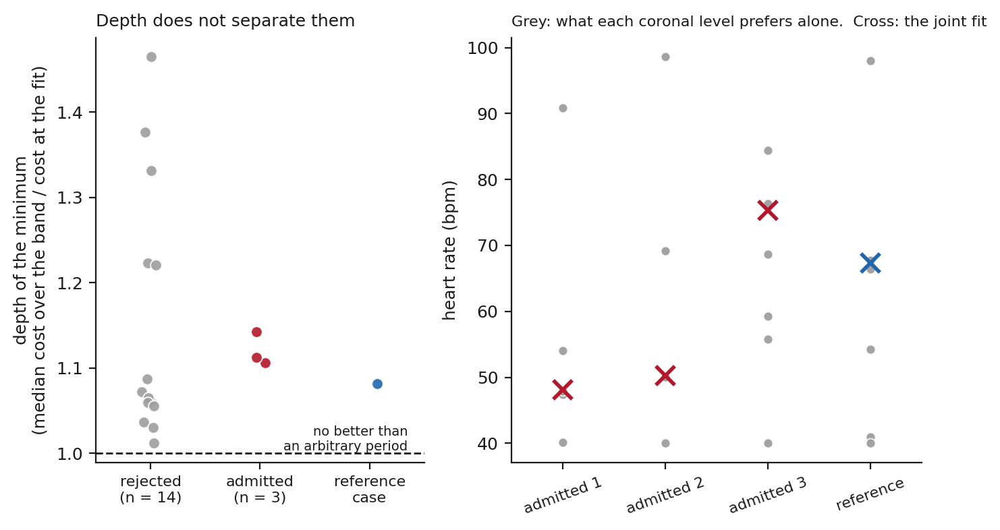
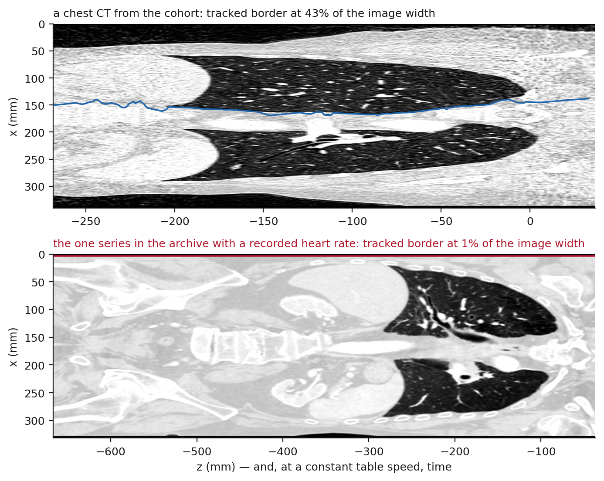

# How much of a heartbeat a non-gated CT records: a header-computable sampling bound, and what a learned estimator does beyond it

<!-- Every number below is a marker resolved at build time from paper/frozen/manifest.json.
     Nothing is typed by hand. See paper/collect_results.py. -->

Shuji Yamamoto

Institute of One, LISIT Co., Ltd., Tokyo 150-0044, Japan

ORCID 0000-0001-9211-1071. E-mail: yamamoto@lisit.jp

## Abstract

**Objective.** Deep-learning methods read the heart in non-gated chest CT, yet none of the
[[results:manifest.json:metrics.cardiac_tag_series_checked]] public series analysed here
records the heart rate by any of
[[results:manifest.json:metrics.cardiac_routes_checked]] routes, so they cannot be checked
against one. We ask what such an acquisition can contain about cardiac timing, and what an
estimator does when it contains nothing.

**Approach.** A helical scan advances the table at constant speed, so its z axis is a time
axis along which a periodically moving structure writes its period. We derive the
recoverability condition, measure the cycles it requires over
[[results:manifest.json:metrics.sensitivity_cells]] simulated conditions, evaluate it on
[[results:manifest.json:metrics.header_series]] real series from headers alone, test
it on [[results:manifest.json:metrics.cohort_analysed]] image series under a criterion frozen
in advance, run the same pipeline on the one public session that records a rate, and train an
estimator that reports its own uncertainty.

**Main results.** Cycles written and samples per cycle multiply to *L*/*dz*: speed only
divides a fixed budget. *N*min =
[[results:manifest.json:metrics.n_min_fundamental]] cycles, which
[[results:manifest.json:metrics.records_below_100bpm_border_percent]] per cent of real series
clear at the cardiac border. On images
[[results:manifest.json:metrics.cohort_recovered]] of
[[results:manifest.json:metrics.cohort_analysed]] were admitted, agreeing with the header
prediction on [[results:manifest.json:metrics.cohort_agreement_percent]] per cent. Those
admissions sit at the same minimum depth as the rejections, their coronal levels
individually preferring rates spanning
[[results:manifest.json:metrics.flatness_level_spread_accepted_min]]–[[results:manifest.json:metrics.flatness_level_spread_accepted_max]]
bpm. The one archive session recording a rate is one where the extraction tracks the
patient's outline, not the mediastinum, and nothing in the pipeline indicated it. An estimator
trained inside the bound was never accurate outside it while reporting a standard deviation
below [[results:manifest.json:metrics.above_reported_sd_below_max]].

**Significance.** The bound is computable from the header and excludes acquisitions that
cannot carry the signal, but satisfying it buys nothing. A stability statistic certifies
nothing unless reported with the depth of the minimum, and with a check on what was fitted.

---

## 1. Introduction

<!-- The framing decision, made deliberately: the subject of the opening sentence is what a
     scan can contain, not what we tried to measure. The cohort appears in section 5 as
     corroboration that the bound is necessary but not sufficient, never as the claim. -->

Chest CT is acquired in very large numbers, and lung cancer screening alone has made it a
population-scale examination (National Lung Screening Trial Research Team 2011). The
heart is in every one of those scans, and automated methods increasingly read it: fully
automated deep-learning coronary calcium scoring now runs on non-gated low-dose chest CT
(Kim et al 2025), and its output depends on the acquisition parameters of the scan it is
given (Chen et al 2026). In the gated setting, deep learning is also used to remove cardiac
motion from the images themselves (Ren et al 2022).

A method of that kind makes a claim about a heart that was never synchronised to the scanner.
The obvious way to check such a claim is to compare it with the rate the scanner recorded,
and that comparison is not available: of the
[[results:manifest.json:metrics.cardiac_tag_series_checked]] series whose images we analysed,
[[results:manifest.json:metrics.cardiac_tag_series_with_field]] record the rate by any of
[[results:manifest.json:metrics.cardiac_routes_checked]] routes through which a CT
acquisition can write one.

Rather than assess any particular method, we ask what the acquisition can contain. Recovering
timing from the image itself is not a new idea in CT. Reconstruction correlated with a
recorded electrocardiogram came first (Kachelrieß and Kalender 1998), and was then replaced
by a signal read out of the projection data — the kymogram (Kachelrieß et al 2002) — and
later by gating estimated from the reconstructed images themselves (Rohkohl et al 2008). The
same idea carried small-animal imaging, where respiratory and cardiac gating without a
physiological monitor became routine (Badea et al 2004, Bartling et al 2007). Every one of
those settings has an acquisition that dwells: a cardiac or micro-CT protocol writes many
cycles into the data. That line of work largely stops around 2009.

A separate literature treats the heart in non-gated chest CT, but structurally — thrombus,
calcification, aortic root, incidental infarct, epicardial fat. Gating inferred from the data
rather than from a monitor has continued elsewhere, in MRI (Larson et al 2003) and in PET,
where it now outperforms device-based gating (Walker et al 2020), but not in helical CT of
the chest. We found no indexed report that recovers cardiac timing from a non-gated helical
CT, and none that states the condition under which it could be recovered.

This paper derives that condition, measures the one constant it depends on, evaluates it
against the installed base from headers alone, tests it on images under a criterion frozen in
advance, and examines what a learned estimator does when the acquisition contains nothing to
learn from. Its central results are negative, and the most useful of them is about how
confidently an estimator and a criterion can both be wrong.

## 2. Theory

### 2.1 The z axis of a helical scan is a time axis

In a helical acquisition the table advances at a constant speed *S* while the gantry rotates,
so the axial coordinate of the reconstructed volume and the time of acquisition are related
by *z* = *St*. The scale is known exactly from the header, and it is the same for every voxel
at a given *z* whatever its row or column: a slice is a slice of time as much as of anatomy.

A structure that moves periodically with period *T* therefore writes that period into the
volume as a *spatial* period along *z*,

> *λ* = *S T*.

For the heart this is the wavy left mediastinal silhouette familiar from a coronal reformat,
which is usually read as a motion artefact. It is also a record of the cardiac cycle, written
whether or not an electrocardiogram was connected. Below the heart the same silhouette
continues as the descending aorta against the left lung, extending the length over which the
wave is available.

### 2.2 The recoverability window

Whether *λ* can be recovered is a sampling question with two sides that pull against each
other.

The scan must be **slow enough** that more than one cycle is written across the structure. If
the available craniocaudal extent is *L*, the number of cycles written is *N* = *L*/*λ* =
*L*/(*ST*), and measuring a period requires *N* to exceed some *N*min. This places an upper
limit on *S*.

The scan must be **fast enough** that each cycle is spread across enough reconstructed
samples to be resolved. With reconstruction interval *dz*, the samples per cycle are *n* =
*λ*/*dz* = *ST*/*dz*, and this must exceed some *n*min. This places a lower limit on *S*.

Together they define a window in table speed, in closed form, for a given *L*, *dz* and heart
rate. The trade-off itself is old — pitch has always been chosen against longitudinal
sampling (Wang and Vannier 1997, Kalender 2006) — but the quantity being traded here is
cardiac timing rather than spatial resolution. Everything the window needs is in the DICOM
header of any helical acquisition: table speed (0018,9309), or equivalently spiral pitch
factor (0018,9311) with total collimation (0018,9307) and revolution time (0018,9305). No
image and no patient information is required to say whether a given scan could carry the
signal.

One ambiguity has to be closed explicitly. The spiral pitch factor of the IEC convention is
table travel per rotation divided by the *total* collimated width, whereas the convention in
use on four-row scanners divided by a *single* row width; the two differ by the number of
rows. The implementation converts between them rather than accepting either silently.

### 2.3 The budget identity

Multiplying the two quantities removes the heart rate and the table speed at once:

> *N* × *n* = (*L*/*ST*) × (*ST*/*dz*) = *L* / *dz*.

**The product of cycles observed and samples per cycle is fixed by the anatomy and the
reconstruction interval alone.** It does not depend on pitch, on rotation time, or on how
fast the heart is beating. A protocol cannot acquire more cardiac timing by running faster or
slower; it can only divide a fixed budget between seeing more cycles and resolving each one
better. Making a scan slower buys cycles at the cost of resolution within a cycle, and making
it faster does the reverse.

This is why the question has a definite answer for each protocol, and why the answer is
computable before any image exists (figure 1). It also locates the one quantity the condition
still needs: the window is bounded by *N*min, and *N*min is not given by the geometry.
Section 3 measures it.

**Figure 1.** Cycles written across the heart against samples per cardiac cycle, at 60 bpm,
on logarithmic axes. Each protocol is a point; the grey lines are the budget *N n* = *L*/*dz*
for three reconstruction intervals, and a protocol can move only along its own line. The
shaded corner is the region in which both conditions hold, bounded below by *N*min =
[[results:manifest.json:metrics.n_min_fundamental]] cycles and on the left by *n* = 8 samples
per cycle. Blue points satisfy both conditions, red points fail at least one. The two 2003
four-row protocols are the acquisitions from which this problem originally arose; the modern
chest protocols sit an order of magnitude to the right and below the bound, having spent the
whole budget on resolution within a cycle.

## 3. How many cycles are needed

### 3.1 Simulation design

How precisely a frequency can be estimated from a finite record is a classical question, and
the answer depends on the observation length, the signal-to-noise ratio and the estimator
(Rife and Boorstyn 1974). What that theory does not give is the number of cycles at which a
particular estimator, reading a particular signal, starts to succeed in practice. *N*min is a
property of the estimation problem — of noise, of how well the cardiac border can be located
against lung and mediastinum, and of how far a real rhythm departs from a fixed period — so
it was measured rather than assumed. A periodic border trace was generated with
a prescribed period, a polynomial baseline standing for anatomy, additive noise, and
beat-to-beat variability, and the period was estimated from it. Recovery was scored against
the prescribed period at a tolerance of
[[results:manifest.json:metrics.tolerance_percent]] per cent, and *N*min for a condition was
taken as the smallest number of written cycles at which at least
[[results:manifest.json:metrics.success_rate_percent]] per cent of
[[results:manifest.json:metrics.trials_per_cell]] trials succeeded.

The sweep covered [[results:manifest.json:metrics.sensitivity_cells]] combinations of noise
level, baseline strength, samples per cycle and rhythm variability, so that the reported
value is a plateau rather than a point.

### 3.2 *N*min is set by the problem, not by the estimator

Two estimators were run over the same traces: one matched to the generating model, and one
using only the fundamental of the trace. The matched estimator reaches
[[results:manifest.json:metrics.n_min_matched]] cycles and the fundamental estimator
[[results:manifest.json:metrics.n_min_fundamental]] cycles. **The remainder of this paper
uses [[results:manifest.json:metrics.n_min_fundamental]]**, because the matched value assumes
knowledge of the waveform that no real trace supplies, and a bound should be stated at the
value a usable estimator can attain.

The figure is stable across the sweep (figure 2):
[[results:manifest.json:metrics.cells_at_headline]] of the
[[results:manifest.json:metrics.sensitivity_cells]] cells return exactly
[[results:manifest.json:metrics.n_min_fundamental]], and the worst cell anywhere in the sweep
returns [[results:manifest.json:metrics.n_min_worst_case]].

**Figure 2.** Left: the fraction of
[[results:manifest.json:metrics.trials_per_cell]] trials in which the prescribed period was
recovered to within [[results:manifest.json:metrics.tolerance_percent]] per cent, against the
number of cycles written, for the matched and the fundamental estimator at the central
parameter condition. *N*min is where each curve crosses
[[results:manifest.json:metrics.success_rate_percent]] per cent, marked by the dashed
verticals at [[results:manifest.json:metrics.n_min_matched]] and
[[results:manifest.json:metrics.n_min_fundamental]] cycles. Right: *N*min obtained
independently in each of the [[results:manifest.json:metrics.sensitivity_cells]] cells of the
sensitivity sweep. The constant is a plateau, not a point estimate. The regime that degrades it is
coarse sampling within a cycle combined with high noise, which is the corner in which the
budget identity of section 2.3 says the two requirements are already competing for the same
fixed product.

## 4. Where real protocols fall

### 4.1 Half of the public archive cannot be asked

Evaluating the condition needs only header fields, but they have to be published. Of
[[results:manifest.json:metrics.collections_probed]] public collections probed in The Cancer
Imaging Archive (Clark et al 2013) for acquisition parameters,
[[results:manifest.json:metrics.collections_with_parameters]] publish them and
[[results:manifest.json:metrics.collections_without_parameters]] do not. For the
latter the question cannot be put at all — not because the scans fail the condition, but
because nothing in the archive says what the table was doing.

This is worth stating plainly because it bounds any future study of the same kind, including
the validation of motion-correction methods that this paper is about. A collection that omits
table speed, pitch, collimation and rotation time cannot support a claim about what its scans
could or could not have recorded.

### 4.2 Table speeds and thresholds

Across [[results:manifest.json:metrics.header_series]] series from
[[results:manifest.json:metrics.header_collections]] collections, table speed runs from
[[results:manifest.json:metrics.table_speed_min]] to
[[results:manifest.json:metrics.table_speed_max]] mm/s, a factor of
[[results:manifest.json:metrics.table_speed_ratio]], with a median of
[[results:manifest.json:metrics.table_speed_median]] mm/s.

Because faster hearts write more cycles into the same distance, each protocol has a *lowest*
rate it can record. Over the cardiac border alone that threshold has a median of
[[results:manifest.json:metrics.threshold_median_border]] bpm, ranging from
[[results:manifest.json:metrics.threshold_min_border]] to
[[results:manifest.json:metrics.threshold_max_border]] bpm, and
[[results:manifest.json:metrics.records_below_100bpm_border]] of
[[results:manifest.json:metrics.header_series]] series —
[[results:manifest.json:metrics.records_below_100bpm_border_percent]] per cent — have a
threshold below [[results:manifest.json:metrics.prediction_ceiling_bpm]] bpm. Using the
longer extent available along the descending aorta, the median threshold falls to
[[results:manifest.json:metrics.threshold_median_aorta]] bpm and
[[results:manifest.json:metrics.records_below_100bpm_aorta_percent]] per cent of series
qualify.

**On the installed base, the acquisition condition is largely satisfied** (figure 3). It is
not what stands between a non-gated chest CT and a cardiac period, which is the reason
section 5 is worth performing at all.

**Figure 3.** The lowest heart rate each of the
[[results:manifest.json:metrics.header_series]] real chest CT series could record, computed
from its header alone at *N*min = [[results:manifest.json:metrics.n_min_fundamental]] cycles,
over the cardiac border (*L* = 120 mm) and over the descending aorta (*L* = 300 mm). The
vertical line is [[results:manifest.json:metrics.prediction_ceiling_bpm]] bpm: series to its
left could record any physiological rate above their own threshold.

The exceptions are instructive. A wide-detector protocol at
[[results:manifest.json:metrics.threshold_wide_detector_speed]] mm/s has a threshold of
[[results:manifest.json:metrics.threshold_wide_detector]] bpm, and a dual-source high-pitch
protocol at [[results:manifest.json:metrics.threshold_dual_source_high_pitch_speed]] mm/s a
threshold of [[results:manifest.json:metrics.threshold_dual_source_high_pitch]] bpm. Both are
far above any physiological rate: these acquisitions cross the heart so quickly that they
write a fraction of one cycle, and no estimator applied to them can be measuring a period.

## 5. The bound is necessary and not sufficient

### 5.1 A cohort under a frozen criterion

<!-- What the frozen criterion measures, stated here so the prose cannot drift from it.
     A series is admitted when the leave-one-out spread of the fitted rate is at most
     10 bpm and the median sigma is at most 1.0. Both are measures of SELF-CONSISTENCY:
     they say the fit did not move when a level was removed. Neither compares the fitted
     rate with the patient's heart rate, because no such rate is recorded
     (section 5.3). The word "recovered" therefore may not appear unqualified anywhere in
     this paper: write "self-consistent", or "recovered" only inside the simulation of
     section 3, where a true period exists. The result files keep the field name
     `recovered` for continuity with the frozen run; the prose does not inherit it. -->

The cohort comprised [[results:manifest.json:metrics.cohort_series]] series, of which
[[results:manifest.json:metrics.cohort_analysed]] yielded a volume the extraction could read;
the remaining [[results:manifest.json:metrics.cohort_technical_failures]] is reported as a
technical failure and enters no count. A series was admitted when the joint fit spanned at
least *N*min = [[results:manifest.json:metrics.n_min_fundamental]] cycles, was not pinned at
either edge of the physiological band, drew on at least three usable coronal levels, moved by
no more than 10 bpm when any one level was dropped, and left a median residual below the
amplitude it had fitted. Those thresholds were written down before any series beyond the
three pilots was fitted.

One detail of that first condition matters and is easy to miss. The implementation counts
cycles over the **z span actually analysed**, not over *L*, the extent of the structure that
section 2 says can carry the motion. For this cohort the two are close: the analysed spans
run from [[results:manifest.json:metrics.cohort_span_min_mm]] to
[[results:manifest.json:metrics.cohort_span_max_mm]] mm with a median of
[[results:manifest.json:metrics.cohort_span_median_mm]] mm against an aortic extent of
[[results:manifest.json:metrics.extent_aorta_mm]] mm, and the same
[[results:manifest.json:metrics.cohort_over_nmin_by_span]] series clear *N*min either way. It
is stated here because for the one series in section 5.4 the two differ by a factor of two,
and there the distinction changes the reading entirely.

**What that criterion measures is self-consistency.** Leave-one-out movement and residual
size both ask whether the fit holds still; neither compares the fitted rate with the
patient's. No series here records one (section 5.4), so correctness was not available to be
tested, and the criterion should not be read as if it had been.

[[results:manifest.json:metrics.cohort_recovered]] of the
[[results:manifest.json:metrics.cohort_analysed]] series met it. The header-level condition
predicted [[results:manifest.json:metrics.cohort_predicted_recoverable]] of them to be
recoverable at a ceiling of [[results:manifest.json:metrics.prediction_ceiling_bpm]] bpm, and
[[results:manifest.json:metrics.cohort_predicted_and_recovered]] of those
[[results:manifest.json:metrics.cohort_predicted_recoverable]] were admitted.

**The pre-specified summary was the agreement between prediction and outcome, not the
admission rate.** The two agreed on [[results:manifest.json:metrics.cohort_agreement]] of
[[results:manifest.json:metrics.cohort_analysed]] series,
[[results:manifest.json:metrics.cohort_agreement_percent]] per cent.

That number needs reading carefully, and we state it descriptively rather than as a test. The
prediction is a header-level statement about whether a rate below
[[results:manifest.json:metrics.prediction_ceiling_bpm]] bpm could in principle be written;
the outcome is a self-consistency verdict that never sees a true rate. They are not two
measurements of the same thing, so their disagreement is not evidence that either is wrong,
and we attach no null distribution to it. What the low agreement does establish is the
negative it was designed to catch: the admissions are not tracking the acquisition parameter
that the bound says should govern them, so whatever the criterion is responding to, it is not
the quantity the header predicts. Sections 5.3 and 5.4 examine what it is responding to
instead.

### 5.2 Four candidate explanations, none of which reproduces the failure

The border traces of the real series do not merely fit worse than simulated ones, they differ
in kind. Comparing [[results:manifest.json:metrics.diagnosis_traces_real]] real traces with
[[results:manifest.json:metrics.diagnosis_traces_simulated]] simulated ones,
[[results:manifest.json:metrics.baseline_share_real_percent]] per cent of the real signal
sits in the smooth baseline the fit removes, against
[[results:manifest.json:metrics.baseline_share_simulated_percent]] per cent of the simulated
signal, and the spread of band power across levels is
[[results:manifest.json:metrics.band_fraction_spread_ratio]] times wider in the real traces
([[results:manifest.json:metrics.band_fraction_spread_real]] against
[[results:manifest.json:metrics.band_fraction_spread_simulated]]). A real trace is mostly
anatomy, and how much of it is anatomy varies from level to level in a way the simulation
never produced.

We tested [[results:manifest.json:metrics.candidates_tested]] candidate explanations for the
failure, each implemented as a modification of the simulation that should have reproduced it.
[[results:manifest.json:metrics.candidates_reproducing_failure]] of them did. The failure was
therefore not explained by anything we had thought of, and section 5.3 reports what it turned
out to be.

### 5.3 The objective is nearly flat, and the criterion never looked

The criterion asks whether the argmin moves. It does not ask whether the cost surface has a
minimum worth finding. Those are different questions whenever the surface is flat, and the
following measurement was not part of the frozen analysis; it was added after the fact, for
the reason given in section 5.4.

Measure the depth of the minimum as the median cost across the whole physiological band
divided by the cost at the period the fit returned. A value of 1.00 would mean the chosen
period fits no better than an arbitrary one.

Across the cohort the depth is
[[results:manifest.json:metrics.flatness_depth_rejected_median]] at the median of the
rejected series, ranging from [[results:manifest.json:metrics.flatness_depth_rejected_min]]
to [[results:manifest.json:metrics.flatness_depth_rejected_max]]. **The
[[results:manifest.json:metrics.cohort_recovered]] admitted series lie inside that range**,
at [[results:manifest.json:metrics.flatness_depth_accepted_min]] to
[[results:manifest.json:metrics.flatness_depth_accepted_max]]: the period chosen in an
accepted series reduces the weighted residual by about a tenth relative to a typical period
in the band, which is what the rejected series do as well. On this measure the admissions are
not distinguishable from the rejections.

They are also not consensus (figure 4). In each of the
[[results:manifest.json:metrics.cohort_recovered]] admitted series the six coronal levels,
fitted independently, prefer rates spanning
[[results:manifest.json:metrics.flatness_level_spread_accepted_min]] to
[[results:manifest.json:metrics.flatness_level_spread_accepted_max]] bpm. The joint fit
imposes one period on levels that individually disagree by half the physiological range, and
returns their weighted compromise.

**What follows from this is about the criterion, and we are careful about how far it goes.**
Two things are measured: the minima the criterion accepted are no deeper than those it
rejected, and the levels it combined did not agree. Neither measurement uses a true rate, so
neither can show that the three admitted rates are *wrong*. What they do show is that the
criterion admitted them without evidence that they are right, which is a different and
weaker claim than the one a reader would take from the word "recovered".

A natural explanation of how that happens is that a flat objective leaves the minimiser
unpinned, so removing one level moves it very little, and the leave-one-out test then reports
stability that reflects the shape of the objective rather than the strength of a signal. That
account is consistent with everything reported here — shallow minima, disagreeing levels, and
stable leave-one-out values occurring together — but co-occurrence is not demonstration, and
we have not constructed the experiment that would separate the flatness from the stability.
We therefore offer it as an explanation to be tested, and rest the conclusion on the
measurements rather than on the mechanism.

One reading it does weaken is that the extraction simply locks onto the wrong peak. With the
best period fitting only about a tenth better than a typical one, there is no peak in these
objectives sharp enough for that description to be apt.

**Figure 4.** Left: depth of the minimum, defined as the median cost across the physiological
band divided by the cost at the period returned, for the series the frozen criterion rejected
and for those it admitted, with the reference case of section 5.4 shown separately. A value
of 1.0, the dashed line, would mean the chosen period fits no better than an arbitrary one.
The admitted series lie inside the range of the rejected ones. Right: for each admitted
series and for the reference case, the rate each of the six coronal levels prefers when
fitted alone (grey), against the rate the joint fit returns (cross). The joint fit reports a
compromise among levels that do not agree.

### 5.4 The one public session that records the rate

A criterion that cannot be compared with a true rate can be diagnosed but not convicted. We
therefore searched the archive for a session that records one. Of
[[results:manifest.json:metrics.tcia_collections_surveyed]] collections,
[[results:manifest.json:metrics.tcia_collections_with_ct]] hold CT and
[[results:manifest.json:metrics.tcia_cardiac_studies]] studies are described as a cardiac
examination; [[results:manifest.json:metrics.tcia_sessions_with_recorded_rate]] sessions
record a rate in the header, and
[[results:manifest.json:metrics.tcia_sessions_with_rate_and_helical]] contains both a
recorded rate and a free-running helical series of the chest.

The rate is not where a reader would look for it. `HeartRate (0018,1088)` is empty throughout;
the scanner writes the rate into the free text of `ScanOptions (0018,0022)` as a minimum,
maximum and average in bpm. A survey restricted to the standard cardiac fields concludes that
no public CT records the rate, and is wrong. The count in section 4 was repeated over
[[results:manifest.json:metrics.cardiac_routes_checked]] routes for that reason.

In that session a gated acquisition records
[[results:manifest.json:metrics.reference_rate_recorded]] bpm, with a minimum of
[[results:manifest.json:metrics.reference_rate_range_low]] and a maximum of
[[results:manifest.json:metrics.reference_rate_range_high]] over its own duration. A helical
series covering [[results:manifest.json:metrics.reference_z_span_mm]] mm at
[[results:manifest.json:metrics.reference_table_speed]] mm/s, lasting
[[results:manifest.json:metrics.reference_scan_seconds]] s, begins ten seconds later.

**How many cycles that acquisition writes depends on which length is used, and this series is
the one case where the difference matters.** At the recorded rate the spatial period is
[[results:manifest.json:metrics.reference_wavelength_mm]] mm. Over the cardiac border, the
*L* = [[results:manifest.json:metrics.extent_border_mm]] mm of section 2, it writes
[[results:manifest.json:metrics.reference_cycles_border]] cycles; over the descending aorta,
*L* = [[results:manifest.json:metrics.extent_aorta_mm]] mm, it writes
[[results:manifest.json:metrics.reference_cycles_aorta]]; over the whole
[[results:manifest.json:metrics.reference_z_span_mm]] mm the pipeline analyses, it writes
[[results:manifest.json:metrics.reference_cycles_at_recorded_rate]]. **Only the last of these
exceeds *N*min = [[results:manifest.json:metrics.n_min_fundamental]], and the last is not the
quantity section 2 defines.** The scan runs from the chin to the pelvis, so most of its
length lies below any structure that a heartbeat can move. By the bound's own terms this
series is below it, and nothing that follows should be read as a test of an acquisition that
cleared the bound.

The cohort of section 5.1 does not have this problem, which is why it is worth separating.
Its analysed spans run from [[results:manifest.json:metrics.cohort_span_min_mm]] to
[[results:manifest.json:metrics.cohort_span_max_mm]] mm with a median of
[[results:manifest.json:metrics.cohort_span_median_mm]] mm, close to the aortic extent, and
the number of series clearing *N*min is
[[results:manifest.json:metrics.cohort_over_nmin_by_span]] of
[[results:manifest.json:metrics.cohort_analysed]] whether the cycles are counted over the
analysed span or over *L* = [[results:manifest.json:metrics.extent_aorta_mm]] mm.

Before the images were downloaded we fixed the criterion for agreement at five per cent of
the recorded rate, that is [[results:manifest.json:metrics.reference_band_low]] to
[[results:manifest.json:metrics.reference_band_high]] bpm. Five per cent is the tolerance
under which *N*min was measured in section 3; the range the scanner itself recorded is
slightly narrower, at four per cent of the mean. The unmodified pipeline was then run.

It returned [[results:manifest.json:metrics.reference_rate_fitted]] bpm,
[[results:manifest.json:metrics.reference_error_percent]] per cent from the recorded rate and
outside the interval. The frozen criterion also rejected the series, on a leave-one-out
spread of [[results:manifest.json:metrics.reference_loo_spread_bpm]] bpm.

What that comparison can carry is limited twice over, and the second limit is severe enough
to settle the matter.

The first is where the reference rate comes from. It was recorded during a different
acquisition ten seconds earlier, and the minimum and maximum the scanner logged bound the
variation within *that* acquisition rather than within this one.

**The second is that the extraction was not on the cardiac border at all** (figure 5). The
method takes the left edge of the soft-tissue run crossing the midline of a coronal row,
which is the left mediastinal border only because a lung separates the chest wall from the
mediastinum and breaks that run. This acquisition runs from the chin to the pelvis with the
arms at the sides, and over most of it no lung intervenes, so the run begins at the skin. In
this series the tracked border sits at
[[results:manifest.json:metrics.border_reference_percent]] per cent of the image width, and
[[results:manifest.json:metrics.border_reference_levels_on_surface]] per cent of its coronal
levels lie within
[[results:manifest.json:metrics.border_surface_threshold_percent]] per cent of the edge. It
is a trace of the patient's outline.

Nothing in the pipeline reported anything unusual. The fit converged, the residual test
passed, the leave-one-out values clustered, and the criterion came within two levels of
admitting the result. **The whole apparatus behaves the same way on a trace of a patient's
skin as on a trace of the cardiac border**, which is the same lesson as section 5.3 arriving
by a different route: the tests in use measure the consistency of a fit and never ask what
was fitted.

This was found by drawing the trace on the image. No automatic check in the pipeline looked,
and `analysis/check_border_position.py`, which does, was written afterwards.

**Figure 5.** Coronal reformats with the tracked border drawn on them. Above, a chest CT from
the cohort: the border follows the mediastinum between the two lungs, which is what the
method is written to find. Below, the one series in the archive that records a heart rate:
the same code, unchanged, returns the skin, because a chin-to-pelvis acquisition with the
arms down offers no lung to separate the chest wall from the mediastinum over most of its
length. The fit, the residual test and the leave-one-out test all proceeded normally on the
lower trace.

The search did not miss what it was looking for (figure 6). The period corresponding to the
recorded rate lies inside the searched band, which was covered at a step of
[[results:manifest.json:metrics.reference_grid_step_mm]] mm, and the cost there is
[[results:manifest.json:metrics.reference_cost_true_over_fitted]] times the minimum; it is
not a local minimum of the objective at all. That is unsurprising once the trace is known to
be an outline rather than a border, and it is reported here because the objective looked no
different from those of section 5.3 before the image was drawn.

**Figure 6.** The objective of the joint fit across the physiological band, for the one
public series whose heart rate is recorded, normalised to its minimum. The darker band is the
rate the scanner recorded during the gated acquisition ten seconds earlier,
[[results:manifest.json:metrics.reference_rate_range_low]] to
[[results:manifest.json:metrics.reference_rate_range_high]] bpm; the lighter band is the
agreement interval fixed before the images were downloaded. The fit takes the global minimum
at [[results:manifest.json:metrics.reference_rate_fitted]] bpm. The recorded rate is not a
local minimum, and the entire band lies within a fifth of the best fit.

Having found it in one series, we measured it in all of them. Of the
[[results:manifest.json:metrics.cohort_analysed]] analysed cohort series,
[[results:manifest.json:metrics.border_cohort_on_the_surface]] track the body surface by the
same definition and [[results:manifest.json:metrics.border_cohort_doubtful]] more sit closer
to the edge than to the middle; the remainder lie between
[[results:manifest.json:metrics.border_sound_min_percent]] and
[[results:manifest.json:metrics.border_sound_max_percent]] per cent of the image width, where
a mediastinum belongs. **All of the affected series were rejected by the frozen criterion**,
and the [[results:manifest.json:metrics.cohort_recovered]] admitted series lie at
[[results:manifest.json:metrics.border_admitted_min_percent]] to
[[results:manifest.json:metrics.border_admitted_max_percent]] per cent, so the result of
section 5.3 is unaffected: those three fits are of the structure they were meant to be of,
and they are still not evidence of recovery.

**What this case establishes is therefore about the archive and about the tests, not about
cardiac timing.** The only session in a public archive that records a heart rate alongside a
free-running helical chest series is one on which this extraction does not work. There is, on
public data, no case against which the recovery performance of this method can be checked —
which is a measured statement rather than the assumption the study began with. And a
criterion built from convergence, residual size and leave-one-out stability came within two
levels of certifying a period fitted to a patient's outline.

## 6. What an estimator does past the bound

Sections 2 to 5 concern what an acquisition contains. This section concerns what a method
does when it contains nothing, which is the situation a deployed estimator meets most of the
time and the one it is least often tested in.

### 6.1 A model that reports its own uncertainty

An estimator was trained on the same simulated traces to predict the period and, alongside
it, its own standard deviation (Kendall and Gal 2017). Reporting an uncertainty is what makes
the experiment informative: a point estimate that is wrong outside the bound is unsurprising,
whereas an uncertainty that stays small while the estimate is wrong is a property one can
measure and act on. That such reports are systematically too confident is established for
modern networks in general (Guo et al 2017), and the gap widens when the input is drawn from
outside the training distribution (Ovadia et al 2019); what is measured here is a case in
which the shift is not a change of dataset but a change of what the data physically contain. Accuracy is counted at the same
[[results:manifest.json:metrics.tolerance_percent]] per cent tolerance used in section 3, and
calibration is the ratio of the error actually made to the standard deviation reported, so
that 1 is honest and larger is overconfident.

Two training conditions were compared: one drawing only on traces at or above
[[results:manifest.json:metrics.n_min_fundamental]] cycles, and one drawing on the whole
range including traces where recovery is impossible.

### 6.2 Trained inside the bound, confident outside it

At and above the bound the model trained there works, reaching
[[results:manifest.json:metrics.above_accuracy_at_bound_percent]] per cent accuracy.

Below the bound it is wrong in every trial —
[[results:manifest.json:metrics.above_accuracy_below_max_percent]] per cent accuracy at every
cycle count tested — while reporting a standard deviation no larger than
[[results:manifest.json:metrics.above_reported_sd_below_max]]. Its calibration ratio there
runs from [[results:manifest.json:metrics.above_calibration_below_min]] to
[[results:manifest.json:metrics.above_calibration_below_max]]: the error it makes is between
twelve and forty times the uncertainty it declares.

**The confidence is worst where it is most dangerous** (figure 7). As the number of written
cycles rises towards the bound the model's reported uncertainty tightens and its accuracy
does not move off zero, so at two cycles it is at its most certain and still never right.

**Figure 7.** Top: the fraction of estimates within
[[results:manifest.json:metrics.tolerance_percent]] per cent of the prescribed period,
against cycles written, for a model trained only at or above the bound and for one trained
across it. Bottom, on a logarithmic scale: the standard deviation each model declares
(circles) and the error it actually makes (squares). Below *N*min, marked by the dashed
vertical, the model trained inside the bound declares the smallest uncertainty of either
while its error is largest — the gap between its circles and its squares is the
overconfidence. The model trained across the boundary keeps the two together. Nothing in its
output distinguishes that state from the regime in which it works. A model of this kind,
applied to a chest CT that writes a fraction of a cycle, returns a number with a small error
bar and no indication that the question was unanswerable.

### 6.3 Trained across the boundary, it widens its uncertainty — and pays for it

Trained on the whole range, the same architecture behaves differently below the bound: its
reported standard deviation widens to
[[results:manifest.json:metrics.across_reported_sd_below_max]] as the cycles run out, and its
calibration ratio falls into [[results:manifest.json:metrics.across_calibration_below_min]]
to [[results:manifest.json:metrics.across_calibration_below_max]], which is honest to
conservative. It reports less certainty where less is warranted. There is no abstention rule
in either model: both always return an estimate, and what differs is the uncertainty attached
to it. Whether that uncertainty is acted on — by declining to report a rate, or by flagging
the scan — is a decision for whoever deploys such an estimator, and it is only available to
them if the uncertainty is calibrated in the first place.

Two qualifications belong with that result, and neither is small.

The first is that it also becomes *accurate* below
[[results:manifest.json:metrics.n_min_fundamental]] cycles, reaching
[[results:manifest.json:metrics.across_accuracy_below_max_percent]] per cent at two cycles.
That is not a violation of the bound; it is the bound at a different value. *N*min depends on
how much the estimator knows about the waveform — the matched estimator of section 3.2
reaches [[results:manifest.json:metrics.n_min_matched]] cycles — and a network trained on
this exact family of traces has been handed that knowledge. In simulation such knowledge is
free. In the clinic the waveform of a cardiac border in a particular patient is not, so
[[results:manifest.json:metrics.n_min_fundamental]] remains the value at which we state the
bound.

The second is that the calibrated model is **worse where the answer is available**. Above the
bound its accuracy reaches
[[results:manifest.json:metrics.across_accuracy_at_bound_percent]] per cent against
[[results:manifest.json:metrics.above_accuracy_at_bound_percent]] per cent for the model
trained only inside, and at the largest cycle counts tested both models degrade. Training a
model to know its limits costs accuracy within them. That is a trade to be made deliberately,
and the point of measuring it is that it can be.

## 7. Discussion

The two empirical halves of this paper describe the same event in different vocabularies.

In section 5 a stability criterion admitted [[results:manifest.json:metrics.cohort_recovered]]
series whose six coronal levels, taken separately, preferred rates spread over
[[results:manifest.json:metrics.flatness_level_spread_accepted_min]] to
[[results:manifest.json:metrics.flatness_level_spread_accepted_max]] bpm, on cost surfaces
whose minima are no deeper than those of the series it rejected. In section 6 an estimator
trained only inside the recoverable regime reported a standard deviation of
[[results:manifest.json:metrics.above_reported_sd_below_max]] while achieving
[[results:manifest.json:metrics.above_accuracy_below_max_percent]] per cent accuracy outside
it. One manufactures agreement, the other manufactures precision. Both report confidence in a
regime that contains no information, and neither is told by its own diagnostics that anything
is wrong.

The difference between them is instructive. The estimator's failure is a training failure and
has a training remedy: shown the boundary during training, the same architecture widens its
reported uncertainty to [[results:manifest.json:metrics.across_reported_sd_below_max]] and
reports it where an answer is not available, while reaching
[[results:manifest.json:metrics.across_accuracy_below_max_percent]] per cent accuracy at two
cycles — the calibration is what changes, not a rule about when to answer. The criterion's failure is a design failure, and its remedy is a
measurement that costs one line: **a stability test certifies nothing unless it is paired
with a test that the objective has a minimum worth being stable about.** We recommend
reporting the depth of the minimum, relative to the median over the searched band, alongside
any stability statistic. Had we done so, none of the three admissions would have been
reported as recoveries.

None of this weakens the geometry, and it is worth separating what survives at what strength.
Three claims of different kinds have been made and should not be read as one.

The budget identity *N n* = *L*/*dz* follows from the definitions and holds for any helical
acquisition. It is the firmest thing here.

*N*min = [[results:manifest.json:metrics.n_min_fundamental]] cycles is an empirical threshold,
measured for one estimator reading one family of simulated traces at one tolerance and one
success rate. It is not a universal limit: the matched estimator of section 3.2 reaches
[[results:manifest.json:metrics.n_min_matched]] cycles on the same traces, and the network of
section 6.3, trained on that family, is accurate at two. What the bound supports is a
practical screen — under the conditions studied here, an acquisition writing appreciably
fewer cycles than this should not be expected to yield a period — rather than a statement
about every possible estimator.

The header-level evaluation of section 4 is narrower still than it first appears. Of
[[results:manifest.json:metrics.header_series]] real chest CT series,
[[results:manifest.json:metrics.records_below_100bpm_border_percent]] per cent have a
threshold below [[results:manifest.json:metrics.prediction_ceiling_bpm]] bpm at an assumed
cardiac extent of [[results:manifest.json:metrics.extent_border_mm]] mm. Because the actual
rates are not recorded, that is a statement about what those protocols could record for a
patient beating fast enough, not a count of acquisitions that did satisfy the condition.

What sections 5.3 and 5.4 add is that clearing the threshold does not by itself produce a
period: on these traces the objective is nearly flat, and the stability the criterion
measures is not evidence that a period was found. The bound is a screen, not a promise.

For the clinical situation that motivates the problem, two consequences follow and they point
in the same direction. The first is that no public chest CT we could find supports validation
against a recorded rate: of [[results:manifest.json:metrics.tcia_collections_surveyed]]
collections surveyed, exactly
[[results:manifest.json:metrics.tcia_sessions_with_rate_and_helical]] session contains both a
recorded rate and a free-running helical series, and the archive is in that respect a single
case rather than a dataset. It is worse than scarcity: of
[[results:manifest.json:metrics.collections_probed]] collections probed for acquisition
parameters, [[results:manifest.json:metrics.collections_without_parameters]] do not publish
them at all, so for those the bound cannot even be evaluated. Anyone proposing to validate a
*cardiac-timing* estimate on public chest CT faces that scarcity directly; how far it extends
to motion-correction methods, whose output is an image rather than a rate and which may be
assessed on image-quality endpoints instead, is a separate question this study does not
settle.

The second is narrower than a claim about deployed software. In the simulation of section 6,
a model trained only where recovery was possible reported a small uncertainty while being
wrong in every trial outside that regime, and a model trained across the boundary did not.
Whether any particular clinical method behaves that way is not something we have tested. What
the experiment does establish is that the failure mode exists and is invisible from the
model's own output, which is an argument for measuring it in a deployed estimator rather
than a finding about one.

## 8. Limitations

**The bound was measured where a true period exists, and applied where one almost never
does.** *N*min = [[results:manifest.json:metrics.n_min_fundamental]] cycles was obtained by
simulation over [[results:manifest.json:metrics.sensitivity_cells]] parameter combinations,
in which the period is prescribed and recovery can be scored against it. It was then
evaluated against [[results:manifest.json:metrics.header_series]] real series through their
acquisition parameters alone, and applied to
[[results:manifest.json:metrics.cohort_analysed]] image series in which no true period is
available. Exactly one real reconstructed image in the archive can be scored against a known
period, and section 5.4 reports it. A single case is a demonstration and not a validation:
it supports no accuracy figure and no statement about a population.

**A fourth candidate cause was found during this revision, and it is the one we can
demonstrate.** The cohort outcome remains consistent with the acquisitions writing too little
of the cycle, with the fit being inadequate on real anatomy, or with cardiac motion departing
too far from a fixed period, and this study does not separate those three. To them must be
added the possibility that the extraction is not on the intended structure at all: in
[[results:manifest.json:metrics.border_cohort_on_the_surface]] of the
[[results:manifest.json:metrics.cohort_analysed]] analysed series, and in the one series with
a recorded rate, the tracked border is the patient's outline rather than the mediastinum, and
nothing in the pipeline indicated it. All of those series were rejected, so the admitted set
of section 5.3 is not affected, but the general point stands: before this revision the study
had no check that it was measuring the right thing.

What the evidence does not support is any claim that no method could recover the period. We
can say that this extraction finds no peak worth locking onto in the traces where it is on
the mediastinum, and that where it is not on the mediastinum the question was never asked.

**No reference heart rate exists in the cohort itself.** None of the
[[results:manifest.json:metrics.cardiac_tag_series_checked]] series retrieved for image
analysis records the rate by any of the
[[results:manifest.json:metrics.cardiac_routes_checked]] routes we checked: the
[[results:manifest.json:metrics.cardiac_standard_fields_checked]] standard DICOM cardiac
fields, and the free text of ScanOptions, where a Siemens cardiac acquisition writes the rate
while leaving the standard fields empty. The one session that does record it is not in the
cohort, and its rate is read from a gated series acquired ten seconds before the series under
test rather than from that series itself; the recorded minimum and maximum,
[[results:manifest.json:metrics.reference_rate_range_low]] and
[[results:manifest.json:metrics.reference_rate_range_high]] bpm, are the scanner's own
measure of how far the rate moved during an acquisition of that length, and are carried into
the tolerance rather than ignored. The archive search that found it keys on study
descriptions naming a cardiac examination, so
[[results:manifest.json:metrics.tcia_sessions_with_rate_and_helical]] is a lower bound.

**What would settle it, and what would not.** Scans of a moving phantom driven at known
periods, repeated across a range of table speeds and pitches, would score recovery against
truth in real reconstructed images and would separate the acquisition and extraction causes
from each other. We did not have access to a scanner and a motion phantom, and this work does
not include such a study. A digital phantom carried through helical forward projection and
reconstruction would reach part of the same ground, testing the extraction on images rather
than on traces and allowing acquisition conditions to be swept; it would not settle the third
cause, because the beat-to-beat variability of such a phantom is an assumption supplied by
the modeller rather than a property of a patient.

**Two analyses here are post-hoc, and their status differs from the rest.** The depth
measurement of section 5.3 and the reference case of section 5.4 were added after the cohort
had been frozen, fitted and written up, in response to editorial feedback on a presubmission
enquiry. The cohort outcome reported in section 5.1 is the frozen one and is unchanged by
them. For the reference case the acceptance interval was fixed in the repository before the
images were downloaded, and the repository history shows that order; we make no claim to an
independently attested timestamp, because a local file and a local commit are both under the
author's control.

## 9. Conclusions

The axial coordinate of a helical CT is a time axis with a scale the header states exactly,
so a periodically moving structure writes its period into the volume as a spatial period. The
condition under which that period can be recovered is a window in table speed, and the
product of the two quantities it trades off — cycles written and samples per cycle — is fixed
at *L*/*dz* by anatomy and reconstruction interval alone. A protocol cannot buy more cardiac
timing by changing its speed; it can only spend a fixed budget differently.

The constant the window depends on was measured, not assumed: an estimator using only the
fundamental of the trace needs
[[results:manifest.json:metrics.n_min_fundamental]] written cycles, stable across
[[results:manifest.json:metrics.cells_at_headline]] of
[[results:manifest.json:metrics.sensitivity_cells]] parameter combinations.

Evaluated against [[results:manifest.json:metrics.header_series]] real chest CT series from
headers alone, the condition is largely met:
[[results:manifest.json:metrics.records_below_100bpm_border_percent]] per cent could record
rates below [[results:manifest.json:metrics.prediction_ceiling_bpm]] bpm at the cardiac
border, and [[results:manifest.json:metrics.records_below_100bpm_aorta_percent]] per cent
could along the descending aorta. The acquisition is not the obstacle.

On images it fails anyway. Under a criterion frozen in advance,
[[results:manifest.json:metrics.cohort_recovered]] of
[[results:manifest.json:metrics.cohort_analysed]] series were admitted, and prediction and
outcome agreed no better than chance at
[[results:manifest.json:metrics.cohort_agreement_percent]] per cent. The admissions are not
recoveries: their cost surfaces are as flat as those of the rejections, their coronal levels
individually prefer rates spanning
[[results:manifest.json:metrics.flatness_level_spread_accepted_min]] to
[[results:manifest.json:metrics.flatness_level_spread_accepted_max]] bpm, and and a leave-one-out
test moves very little on an objective that shallow. The single public session that records a
heart rate turns out to be one on which this extraction tracks the patient's outline rather
than the mediastinum, so the archive contains no case on which the method's recovery can be
checked against a recorded rate — and the criterion came within two levels of certifying the
period it fitted to that outline.

An estimator trained only where recovery is possible is wrong in every trial outside that
regime while reporting a standard deviation below
[[results:manifest.json:metrics.above_reported_sd_below_max]], tightening its confidence as
it approaches the boundary from the side where it never succeeds.

Two things follow for anyone measuring cardiac timing in a non-gated chest CT. The bound is
worth computing, because it is free, it comes from the header, and it excludes acquisitions
that cannot carry the signal at all. And a stability statistic must be reported with the
depth of the minimum it is stable about, because on a flat objective stability is evidence of
nothing — a lesson this study learned from its own frozen criterion.

## Declarations

**Author and affiliation.** Shuji Yamamoto, Institute of One, LISIT Co., Ltd., Tokyo
150-0044, Japan. ORCID 0000-0001-9211-1071. Correspondence: yamamoto@lisit.jp.

**Funding.** This work received no external funding. It was carried out within LISIT Co.,
Ltd.

**Competing interests.** The author is the representative of LISIT Co., Ltd., a provider of
medical imaging analysis services, and this work was carried out within that company. The
company received no funding for the study, played no part in its design, analysis or
reporting, and markets no product based on the method examined here. The author declares no
competing interest beyond the affiliation stated above.

**Ethical statement.** This study used only publicly available, de-identified imaging
distributed by The Cancer Imaging Archive under Creative Commons licences, and generated no
new patient data. No institutional review board approval was sought, on the grounds that
secondary analysis of de-identified public data does not constitute human subjects research;
approval for the original acquisitions rests with the contributing institutions and is
recorded by the archive. Patient identifiers and series instance identifiers appearing in the
released results are the archive's own de-identified ones.

**Data and code availability.** All analysis code, the frozen decision rules and every result
file from which the figures and numbers in this paper are computed are available at
https://github.com/Institute-of-One/non-ecg-core, at the tagged release v0.1.0 that
accompanies this manuscript. A clean copy of that release, installed from its own
requirements in an empty environment, reproduces every number and every figure in this paper;
the script that checks it is in the release. An archived, DOI-bearing copy is being deposited
with Zenodo and the identifier will be supplied at revision. No imaging data is
redistributed; the analysis retrieves it from The Cancer Imaging Archive by series
identifier, and the collections used are cited above.

**Use of generative AI.** The research question, the physical argument of section 2, the
study design and the decision rules recorded in the repository are the author's, and predate
the assistance described here. Generative AI (Claude, Anthropic) was used as a tool in
preparing this work: to write and test analysis code, to carry out the survey of the public
archive reported in section 5.4, to produce the figures from the frozen result files, and to
draft manuscript text from results that already existed. No AI system contributed a research
idea, chose a decision rule, or determined a result. Every number in this paper is resolved
at build time from a result file produced by code in the public repository, every reference
is resolved from its DOI rather than written out, and the author has checked the manuscript
against those files and takes full responsibility for its content, including the parts
drafted with assistance.

**Prior contact.** The editorial office was consulted before submission regarding the
suitability of this work as a Paper.

## References

<!-- references: generated by paper/check_references.py; do not edit by hand -->

1. Badea C, Hedlund L W and Johnson G A 2004 Micro‐CT with respiratory and cardiac gating *Medical Physics* **31** 3324–3329 (DOI: 10.1118/1.1812604)

2. Bartling S H et al 2007 Retrospective Motion Gating in Small Animal CT of Mice and Rats *Investigative Radiology* **42** 704–714 (DOI: 10.1097/rli.0b013e318070dcad)

3. Chen Y et al 2026 Impact of scanning parameters on deep learning coronary artery calcium scoring in non‑gated chest CT *BMC Medical Imaging* **26** (DOI: 10.1186/s12880-026-02306-2)

4. Clark K et al 2013 The Cancer Imaging Archive (TCIA): Maintaining and Operating a Public Information Repository *Journal of Digital Imaging* **26** 1045–1057 (DOI: 10.1007/s10278-013-9622-7)

5. Guo C et al 2017 On Calibration of Modern Neural Networks *arXiv* (DOI: 10.48550/arXiv.1706.04599)

6. Kachelrieß M and Kalender W A 1998 Electrocardiogram‐correlated image reconstruction from subsecond spiral computed tomography scans of the heart *Medical Physics* **25** 2417–2431 (DOI: 10.1118/1.598453)

7. Kachelrieß M et al 2002 Kymogram detection and kymogram‐correlated image reconstruction from subsecond spiral computed tomography scans of the heart *Medical Physics* **29** 1489–1503 (DOI: 10.1118/1.1487861)

8. Kalender W A 2006 X-ray computed tomography *Physics in Medicine and Biology* **51** R29–R43 (DOI: 10.1088/0031-9155/51/13/R03)

9. Kendall A and Gal Y 2017 What Uncertainties Do We Need in Bayesian Deep Learning for Computer Vision? *arXiv* (DOI: 10.48550/arXiv.1703.04977)

10. Kim S et al 2025 Performance of fully automated deep-learning-based coronary artery calcium scoring in ECG-gated calcium CT and non-gated low-dose chest CT *European Radiology* **35** 7084–7095 (DOI: 10.1007/s00330-025-11559-4)

11. Larson A C et al 2003 Self‐gated cardiac cine MRI *Magnetic Resonance in Medicine* **51** 93–102 (DOI: 10.1002/mrm.10664)

12. Li P et al 2020 A Large-Scale CT and PET/CT Dataset for Lung Cancer Diagnosis (dataset) The Cancer Imaging Archive (DOI: 10.7937/TCIA.2020.NNC2-0461)

13. National Cancer Institute Clinical Proteomic Tumor Analysis Consortium (CPTAC) 2018 The Clinical Proteomic Tumor Analysis Consortium Lung Adenocarcinoma Collection (CPTAC-LUAD) (dataset) The Cancer Imaging Archive (DOI: 10.7937/K9/TCIA.2018.PAT12TBS)

14. Ovadia Y et al 2019 Can You Trust Your Model's Uncertainty? Evaluating Predictive Uncertainty Under Dataset Shift *arXiv* (DOI: 10.48550/arXiv.1906.02530)

15. Patnana M, Patel S and Tsao A S 2019 Data from Anti-PD-1 Immunotherapy Lung (dataset) The Cancer Imaging Archive (DOI: 10.7937/TCIA.2019.ZJJWB9IP)

16. Ren P et al 2022 Motion artefact reduction in coronary CT angiography images with a deep learning method *BMC Medical Imaging* **22** (DOI: 10.1186/s12880-022-00914-2)

17. Rife D and Boorstyn R 1974 Single tone parameter estimation from discrete-time observations *IEEE Transactions on Information Theory* **20** 591–598 (DOI: 10.1109/TIT.1974.1055282)

18. Rohkohl C et al 2008 Cardiac C-arm CT: image-based gating *SPIE Proceedings* **6913** 69131G (DOI: 10.1117/12.770124)

19. Saltz J et al 2021 Stony Brook University COVID-19 Positive Cases (dataset) The Cancer Imaging Archive (DOI: 10.7937/TCIA.BBAG-2923)

20. National Lung Screening Trial Research Team 2011 Reduced Lung-Cancer Mortality with Low-Dose Computed Tomographic Screening *New England Journal of Medicine* **365** 395–409 (DOI: 10.1056/NEJMoa1102873)

21. Research for Precision Oncology Program  and the Applied Proteogenomics Organizational Learning and Outcomes (APOLLO) Research Network 2024 VA Research Precision Oncology Program - APOLLO (VAREPOP-APOLLO) (dataset) The Cancer Imaging Archive (DOI: 10.7937/GHKN-MD15)

22. Walker M D et al 2020 Data-Driven Respiratory Gating Outperforms Device-Based Gating for Clinical 18F-FDG PET/CT *Journal of Nuclear Medicine* **61** 1678–1683 (DOI: 10.2967/jnumed.120.242248)

23. Wang G and Vannier M W 1997 Optimal pitch in spiral computed tomography *Medical Physics* **24** 1635–1639 (DOI: 10.1118/1.597971)

24. Zhao B et al 2015 Coffee-break lung CT collection with scan images reconstructed at multiple imaging parameters (dataset) The Cancer Imaging Archive (DOI: 10.7937/K9/TCIA.2015.U1X8A5NR)

<!-- end references -->
