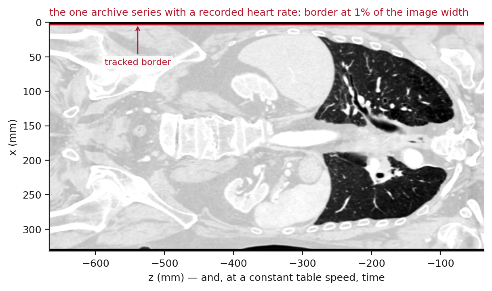
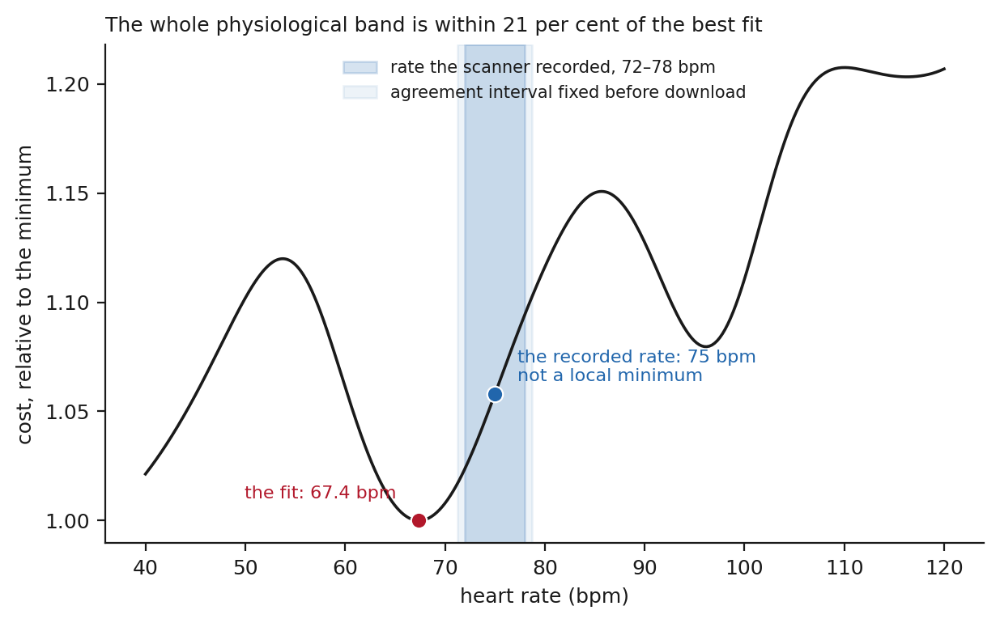

# Supplementary material

**How much of a heartbeat a non-gated CT records: a header-computable sampling bound, and
what a learned estimator does beyond it**

Shuji Yamamoto, Institute of One, LISIT Co., Ltd., Tokyo 150-0044, Japan

This material records a run that is referred to in section 5.4 of the main text and is not
used in any estimate there. It is included because the protocol was fixed before the data
were fetched and the result should be visible whatever it turned out to be, and because the
way it failed is the reason the main text now reports where the tracked border lies.

## S1 The session, and the protocol fixed before it

A survey of [[results:manifest.json:metrics.tcia_collections_surveyed]] collections of The
Cancer Imaging Archive found
[[results:manifest.json:metrics.tcia_sessions_with_rate_and_helical]] session holding both a
recorded heart rate and a free-running helical series of the chest: collection
VAREPOP-APOLLO, patient AP-26JK, study described as a cardiac CTA. A gated acquisition in
that session records [[results:manifest.json:metrics.reference_rate_recorded]] bpm, with a
minimum of [[results:manifest.json:metrics.reference_rate_range_low]] and a maximum of
[[results:manifest.json:metrics.reference_rate_range_high]] over its own duration, written
into the free text of `ScanOptions (0018,0022)` rather than into `HeartRate (0018,1088)`,
which is empty. A helical series covering
[[results:manifest.json:metrics.reference_z_span_mm]] mm at
[[results:manifest.json:metrics.reference_table_speed]] mm/s, lasting
[[results:manifest.json:metrics.reference_scan_seconds]] s, begins ten seconds later.

Before the images were downloaded, an interval for agreement was fixed at five per cent of
the recorded rate, [[results:manifest.json:metrics.reference_band_low]] to
[[results:manifest.json:metrics.reference_band_high]] bpm, in
`analysis/tcia_search/validation_protocol.md`. Five per cent is the tolerance under which
*N*min was measured; the range the scanner itself recorded is narrower, at four per cent of
the mean. The unmodified pipeline was then run.

## S2 What the run returned, and why it is not used

The pipeline returned [[results:manifest.json:metrics.reference_rate_fitted]] bpm, which is
[[results:manifest.json:metrics.reference_error_percent]] per cent from the recorded rate and
outside the interval. The frozen criterion rejected the series, on a leave-one-out spread of
[[results:manifest.json:metrics.reference_loo_spread_bpm]] bpm.

Neither figure is evidence about cardiac timing, because the extraction did not return the
intended anatomical border (figure S1). The tracked position lies at
[[results:manifest.json:metrics.border_reference_percent]] per cent of the image width, where
a mediastinum in the cohort lies between
[[results:manifest.json:metrics.border_sound_min_percent]] and
[[results:manifest.json:metrics.border_sound_max_percent]] per cent, and at one coronal level
it is constant to numerical precision across the whole scan. The acquisition runs from the
chin to the pelvis with the arms at the sides; the method takes the left edge of the
soft-tissue run crossing the midline of a coronal row, which is the mediastinal border only
where a lung breaks that run.

**Figure S1.** The coronal reformat of the series under test, at its own aspect, with the
tracked border drawn on it. Compare figure 5 of the main text, where the same code follows
the mediastinum between the two lungs.

**Figure S2.** The objective of the joint fit across the physiological band for that series,
normalised to its minimum, with the recorded rate and the interval fixed in advance marked.
The recorded rate is not a local minimum, and the whole band lies within a fifth of the best
fit. Since the trace is not of the intended structure, this says nothing about whether a
cardiac period could have been recovered from a scan of this geometry; it is shown because
the objective looked no different from those of section 5.3 until the image was drawn.

## S3 What followed

`analysis/check_border_position.py`, which measures where the tracked border lies in every
cached series, was written after this run and did not exist while the cohort was analysed.
Applied to the cohort it finds
[[results:manifest.json:metrics.border_cohort_on_the_surface]] of
[[results:manifest.json:metrics.cohort_analysed]] series within
[[results:manifest.json:metrics.border_surface_threshold_percent]] per cent of the image
edge, and [[results:manifest.json:metrics.border_cohort_doubtful]] more closer to the edge
than to the middle. All were rejected by the frozen criterion, and the
[[results:manifest.json:metrics.cohort_recovered]] admitted series lie at
[[results:manifest.json:metrics.border_admitted_min_percent]] to
[[results:manifest.json:metrics.border_admitted_max_percent]] per cent.
